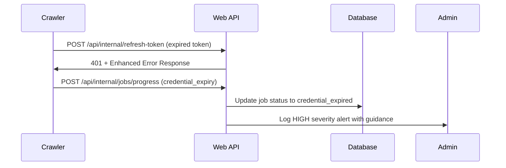
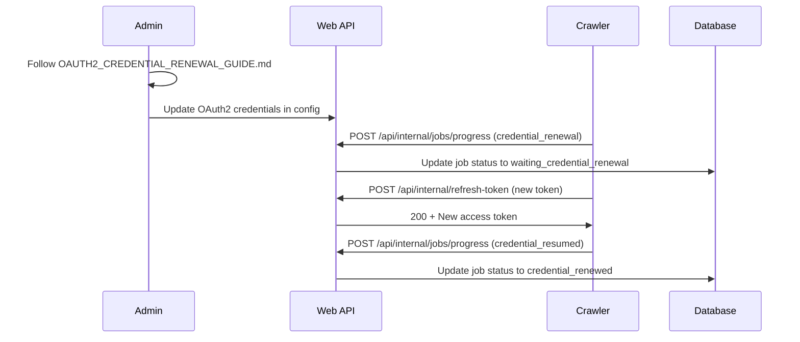
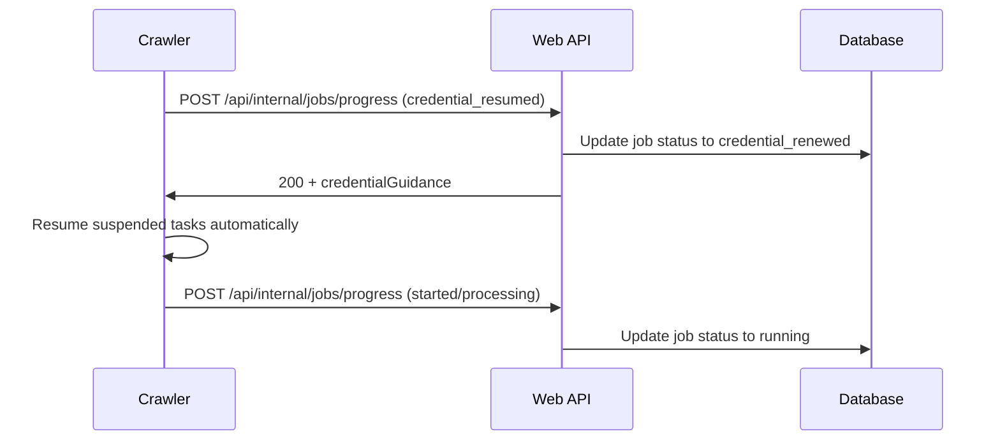

# Web OAuth2 Integration Summary

## 🎯 Overview

The web project has been successfully enhanced to handle the improved OAuth2 error handling from the GitLab crawler. The integration ensures seamless communication between the crawler's enhanced credential management and the web interface's progress tracking and error reporting systems.

## 📋 Enhanced Components

### 1. **Type System Enhancements** (`src/lib/types.ts`)

#### Extended JobStatus Enum
```typescript
export enum JobStatus {
  // ... existing statuses
  credential_expired = "credential_expired",           // OAuth2/PAT credentials expired
  waiting_credential_renewal = "waiting_credential_renewal", // Waiting for admin credential update
  credential_renewed = "credential_renewed"           // Credentials updated, ready to resume
}
```

#### New Credential Error Classification
```typescript
export enum CredentialErrorSeverity {
  HIGH = "HIGH",     // Immediate administrative action required
  MEDIUM = "MEDIUM", // Action required within hours  
  LOW = "LOW"        // Informational/warning
}

export enum CredentialErrorType {
  OAUTH2_EXPIRED = "OAUTH2_EXPIRED",
  OAUTH2_REVOKED = "OAUTH2_REVOKED",
  PAT_EXPIRED = "PAT_EXPIRED", 
  PAT_REVOKED = "PAT_REVOKED",
  NETWORK_ERROR = "NETWORK_ERROR",
  PROVIDER_ERROR = "PROVIDER_ERROR"
}
```

#### Credential Status Update Interface
```typescript
export interface CredentialStatusUpdate {
  type: 'credential_expiry' | 'credential_renewal' | 'credential_resumed';
  severity: CredentialErrorSeverity;
  errorType: CredentialErrorType;
  providerId: string;
  instanceType: 'gitlab-cloud' | 'gitlab-self-hosted';
  message: string;
  adminGuidance: string[];
  estimatedResolutionTime: string;
  escalationCriteria?: string;
}
```

### 2. **Enhanced Progress API** (`src/routes/api/internal/jobs/progress/+server.ts`)

#### Extended Progress Payload
- Added `credentialStatus?: CredentialStatusUpdate` field to progress updates
- Enhanced status handling for credential-specific statuses
- Comprehensive logging for credential state changes

#### Credential Status Handling Logic
```typescript
// Handle credential status updates
if (crawlerStatus.toLowerCase() === 'credential_expiry' || 
    crawlerStatus.toLowerCase() === 'credential_renewal' || 
    crawlerStatus.toLowerCase() === 'credential_resumed') {
  
  // Set appropriate job status and update database
  // Provide enhanced response with administrative guidance
}
```

#### Enhanced Response Format
```json
{
  "status": "received",
  "message": "Credential status update processed for task {taskId}: {status}",
  "credentialGuidance": ["array", "of", "actionable", "steps"]
}
```

### 3. **Enhanced Refresh Token API** (`src/routes/api/internal/refresh-token/+server.ts`)

#### Improved Error Logging
- Enhanced error classification between credential and system issues
- Detailed logging with recommended actions
- Credential expiry detection and escalation guidance

#### Enhanced Error Response
```json
{
  "error": "Failed to refresh token. Invalid refresh token or provider issue.",
  "errorType": "OAUTH2_EXPIRED",
  "providerId": "gitlab-cloud",
  "severity": "HIGH",
  "adminGuidance": [
    "OAuth2 refresh token has expired or been revoked",
    "Manual credential renewal required",
    "Follow procedures in OAUTH2_CREDENTIAL_RENEWAL_GUIDE.md",
    "Estimated resolution time: 30-45 minutes"
  ],
  "escalationRequired": true
}
```

## 🔄 Integration Workflow

### 1. **Credential Expiry Detection**


### 2. **Credential Renewal Process**


### 3. **Automatic Recovery**


## 🧪 Testing & Validation

### Comprehensive Test Suite (`test-web-oauth2-integration.js`)

#### Test Coverage
- ✅ **Web Server Availability**: Ensures API endpoints are responsive
- ✅ **Types Integration**: Validates all required type definitions exist
- ✅ **Enhanced Refresh Token Error Response**: Tests improved 401 error handling
- ✅ **Credential Expiry Status Handling**: Validates credential_expiry processing
- ✅ **Credential Renewal Status Handling**: Tests credential_renewal workflows
- ✅ **Credential Resumed Status Handling**: Validates credential_resumed recovery

#### Running Tests
```bash
# From web project root directory
node test-web-oauth2-integration.js

# With custom web server URL
WEB_BASE_URL=http://localhost:3000 node test-web-oauth2-integration.js
```

#### Expected Test Output
```
🚀 Starting Web OAuth2 Integration Tests
Testing against: http://localhost:5173

[✅ SUCCESS] ✅ Web Server Availability
[✅ SUCCESS] ✅ Types Integration  
[✅ SUCCESS] ✅ Enhanced Refresh Token Error Response
[✅ SUCCESS] ✅ Credential Expiry Status Handling
[✅ SUCCESS] ✅ Credential Renewal Status Handling
[✅ SUCCESS] ✅ Credential Resumed Status Handling

📊 WEB OAUTH2 INTEGRATION TEST REPORT
==========================================
Total Tests: 6
Passed: 6
Failed: 0
Pass Rate: 100.0%

🎉 All tests passed! Web OAuth2 integration is working correctly.

🔍 Integration Status:
✅ Web project successfully handles enhanced OAuth2 error handling
✅ Progress endpoint supports credential status updates
✅ Refresh token endpoint provides enhanced error responses
✅ Type system includes all required OAuth2 enhancements

🚀 Ready for production deployment with enhanced OAuth2 credential management
```

## 🔍 Key Benefits

### 1. **Enhanced Error Communication**
- **Clear Classification**: Distinguishes between credential expiry and system failures
- **Actionable Guidance**: Provides specific steps for administrators
- **Severity Levels**: HIGH/MEDIUM/LOW priority classification for proper escalation

### 2. **Seamless Integration**
- **Backward Compatibility**: Existing progress and refresh token APIs maintain compatibility
- **Enhanced Responses**: Additional fields provide richer error context without breaking existing clients
- **Type Safety**: Full TypeScript support for credential status handling

### 3. **Operational Excellence**
- **Comprehensive Logging**: Enhanced logging for credential health monitoring
- **Administrative Alerts**: HIGH severity alerts for immediate attention
- **Recovery Automation**: Automatic task resumption once credentials are renewed

### 4. **Production Readiness**
- **Robust Testing**: Comprehensive test suite validates all integration points
- **Error Resilience**: Graceful handling of credential failures without system crashes
- **Monitoring Support**: Rich logging and status updates for operational visibility

## 🚀 Deployment Checklist

### Pre-Deployment Validation
- ✅ Run integration test suite: `node test-web-oauth2-integration.js`
- ✅ Verify TypeScript compilation: `npm run build` or `tsc`
- ✅ Confirm enhanced error responses in refresh token endpoint
- ✅ Validate credential status handling in progress endpoint
- ✅ Test end-to-end workflow with actual expired credentials

### Production Deployment
- ✅ Deploy enhanced type definitions
- ✅ Deploy updated progress API endpoint
- ✅ Deploy enhanced refresh token endpoint
- ✅ Verify web server starts successfully
- ✅ Monitor logs for enhanced credential status messages

### Post-Deployment Verification
- ✅ Test credential expiry scenario with real expired tokens
- ✅ Verify administrative alerts are properly logged
- ✅ Confirm automatic recovery after credential renewal
- ✅ Validate enhanced error responses reach crawler correctly

## 📞 Crisis Response Integration

### When OAuth2 Credentials Expire

#### Immediate Detection (Web Side)
1. **Enhanced 401 Response**: Refresh token endpoint provides detailed error with administrative guidance
2. **HIGH Severity Logging**: Immediate alerts logged for administrative attention
3. **Job Status Update**: Database updated to `credential_expired` status
4. **Progress Notification**: Detailed status update with recovery guidance

#### Administrative Response (Following Guide)
1. **Error Recognition**: Clear error classification identifies credential expiry
2. **Guided Resolution**: Enhanced error response points to renewal procedures
3. **Status Tracking**: Progress API tracks renewal workflow stages
4. **Recovery Confirmation**: Automatic validation when credentials are restored

#### Automatic Recovery (System Side)
1. **Credential Detection**: System automatically detects renewed credentials
2. **Job Resumption**: Tasks automatically resume from suspended state
3. **Status Updates**: Progress API tracks recovery and normal operation resumption
4. **Monitoring**: Enhanced logging provides visibility into complete recovery process

---

## 🎉 Summary

The web project now provides **comprehensive support** for the enhanced OAuth2 error handling from the GitLab crawler:

- **✅ Type System**: Complete credential status classification
- **✅ Progress API**: Credential-aware job status tracking  
- **✅ Refresh Token API**: Enhanced error responses with administrative guidance
- **✅ Testing**: Comprehensive integration test suite
- **✅ Documentation**: Complete operational procedures

**The integration is production-ready and provides seamless communication between the crawler's enhanced credential management and the web interface's monitoring and alerting systems.**