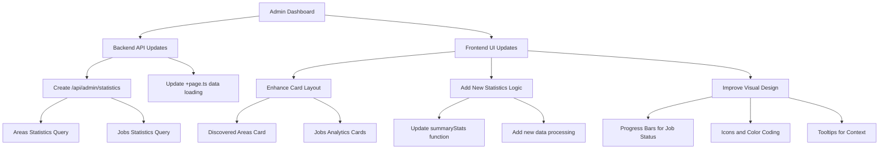

# Admin Dashboard Statistics Enhancement Plan

## Overview

This plan enhances the admin dashboard statistics to provide more detailed and organized metrics, specifically focusing on "Discovered Areas" and granular job statistics as requested.

## Current State Analysis

### Existing Data Structure
- **Areas**: Stored in `area` table with `type` field (group/project)
- **Jobs**: Stored in `job` table with `status` and `command` fields
- **API Endpoints**: `/api/admin/areas`, `/api/admin/jobs`, `/api/admin/users`, `/api/admin/tokenInfos`
- **Dashboard**: 4 basic summary cards (Users, Tokens, Survey Areas, Total Jobs)

### Issues to Address
1. "Survey Areas" should become "Discovered Areas" with breakdown
2. "Total Jobs" needs granular status breakdown
3. Missing GROUP_PROJECT_DISCOVERY job statistics
4. Limited visual hierarchy and organization

## Implementation Plan

### 1. Backend API Enhancements

#### 1.1 New Statistics Endpoint
**File**: `src/routes/api/admin/statistics/+server.ts`

**Statistics to Provide**:
```typescript
interface AdminStatistics {
  areas: {
    total: number;
    groups: number;
    projects: number;
  };
  jobs: {
    total: number;
    completed: number;
    active: number;
    queued: number;
    failed: number;
    groupProjectDiscovery: number;
  };
  users: number;
  tokens: number;
}
```

**SQL Queries Required**:
- Areas: `SELECT COUNT(*) FROM area WHERE type = 'group'|'project'`
- Jobs: `SELECT COUNT(*) FROM job WHERE status = 'finished'|'running'|'paused'|'queued'|'failed'`
- Discovery Jobs: `SELECT COUNT(*) FROM job WHERE command = 'GROUP_PROJECT_DISCOVERY'`

#### 1.2 Update Data Loading
**File**: `src/routes/admin/+page.ts`
- Add: `statistics: fetchAdminData(event.fetch, "statistics", token, { description: "Loading statistics..." })`
- Keep existing endpoints for backward compatibility

### 2. Frontend UI Enhancements

#### 2.1 Enhanced Card Layout

**New Layout Structure**:
```
Row 1: Core Metrics (2 cards)
┌─────────────────────┬─────────────────────┐
│   Users & Tokens    │  Discovered Areas   │
│                     │                     │
│ Users: 125          │ Total: 450          │
│ Tokens: 12          │ Groups: 85          │
│                     │ Projects: 365       │
└─────────────────────┴─────────────────────┘

Row 2: Job Analytics (3 cards)
┌───────────────┬───────────────┬───────────────┐
│ Jobs Overview │ Job Breakdown │ Discovery Jobs│
│               │               │               │
│ Total: 1,250  │ Completed:    │ GROUP_PROJECT │
│ Active: 45    │ ████████ 85%  │ DISCOVERY:    │
│               │ Failed: 12    │ 23 jobs       │
└───────────────┴───────────────┴───────────────┘
```

#### 2.2 Component Enhancements

**shadcn-svelte Components to Use**:
- `Card` components with enhanced headers and content
- `Progress` bars for job status ratios
- `Separator` for visual organization within cards
- `Tooltip` for additional context on hover
- Lucide icons for visual hierarchy

**Visual Design Elements**:
- Color coding: Green (completed), Blue (active), Yellow (queued), Red (failed)
- Progress indicators for job completion rates
- Prominent numbers with descriptive labels
- Icon-based visual hierarchy

#### 2.3 Data Processing Logic

**File**: `src/routes/admin/+page.svelte`

**Enhanced summaryStats**:
```typescript
const summaryStats = $derived.by(async () => {
  const [users, statistics, tokenInfos] = await Promise.all([
    data.users,
    data.statistics,
    data.tokenInfos
  ]);

  return {
    users: Array.isArray(users) ? users.length : 0,
    tokens: (tokenInfos && typeof tokenInfos === 'object' && 'result' in tokenInfos && tokenInfos.result)
      ? Object.keys(tokenInfos.result).length : 0,
    areas: statistics?.areas || { total: 0, groups: 0, projects: 0 },
    jobs: statistics?.jobs || { 
      total: 0, completed: 0, active: 0, 
      queued: 0, failed: 0, groupProjectDiscovery: 0 
    }
  };
});
```

### 3. Implementation Architecture



### 4. Database Queries Implementation

#### 4.1 Areas Statistics
```sql
-- Total areas
SELECT COUNT(*) as total FROM area;

-- Groups count  
SELECT COUNT(*) as groups FROM area WHERE type = 'group';

-- Projects count
SELECT COUNT(*) as projects FROM area WHERE type = 'project';
```

#### 4.2 Jobs Statistics
```sql
-- Total jobs
SELECT COUNT(*) as total FROM job;

-- Completed jobs
SELECT COUNT(*) as completed FROM job WHERE status = 'finished';

-- Active jobs (running + paused)
SELECT COUNT(*) as active FROM job WHERE status IN ('running', 'paused');

-- Queued jobs
SELECT COUNT(*) as queued FROM job WHERE status = 'queued';

-- Failed jobs  
SELECT COUNT(*) as failed FROM job WHERE status = 'failed';

-- GROUP_PROJECT_DISCOVERY jobs
SELECT COUNT(*) as groupProjectDiscovery FROM job WHERE command = 'GROUP_PROJECT_DISCOVERY';
```

### 5. File Changes Required

#### Backend Files:
1. **Create**: `src/routes/api/admin/statistics/+server.ts`
2. **Modify**: `src/routes/admin/+page.ts`

#### Frontend Files:
1. **Modify**: `src/routes/admin/+page.svelte`
   - Update card layout structure
   - Enhance summaryStats function
   - Add progress bars and visual indicators
   - Implement new icon scheme

### 6. Implementation Benefits

1. **Better Organization**: Logical grouping of related metrics
2. **Enhanced Visibility**: More granular job status information 
3. **Discovery Focus**: Special attention to GROUP_PROJECT_DISCOVERY jobs
4. **Visual Appeal**: Better use of shadcn-svelte components
5. **Performance**: Single statistics API call for efficiency
6. **Scalability**: Easy to add more statistics in the future

### 7. Implementation Steps

1. **Phase 1**: Create statistics API endpoint
2. **Phase 2**: Update data loading in +page.ts
3. **Phase 3**: Redesign dashboard cards layout
4. **Phase 4**: Add visual enhancements (progress bars, icons)
5. **Phase 5**: Testing and refinements

### 8. Success Criteria

- ✅ "Survey Areas" replaced with "Discovered Areas" showing total/groups/projects
- ✅ "Total Jobs" replaced with granular job status breakdown
- ✅ GROUP_PROJECT_DISCOVERY jobs prominently displayed
- ✅ Improved visual hierarchy and organization
- ✅ Maintains existing loading states and error handling
- ✅ Uses appropriate shadcn-svelte components for enhanced UX

## Next Steps

1. Switch to code mode for implementation
2. Create the statistics API endpoint
3. Update the dashboard UI components
4. Test the new statistics display
5. Refine visual design and user experience