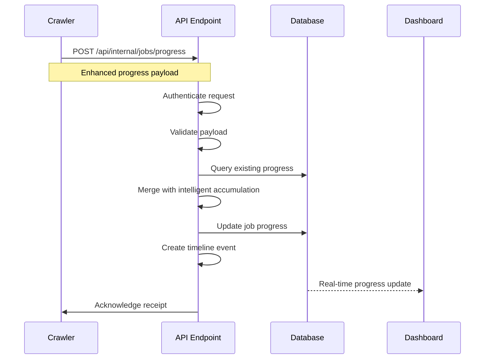

# Progress Tracking System Overview

This document provides a high-level overview of the enhanced progress tracking system architecture, data flow, and key capabilities for crawler operations in the web application.

## Table of Contents

1. [System Architecture](#system-architecture)
2. [Data Flow](#data-flow)
3. [Key Components](#key-components)
4. [Integration Points](#integration-points)
5. [Monitoring and Debugging](#monitoring-and-debugging)
6. [Performance Considerations](#performance-considerations)

## System Architecture

### High-Level Architecture

The progress tracking system consists of three main layers:

```
┌─────────────────┐    ┌─────────────────┐    ┌─────────────────┐
│   Crawler       │───▶│  Web Application │───▶│   Dashboard     │
│   Processes     │    │   API Endpoints  │    │   Interface     │
└─────────────────┘    └─────────────────┘    └─────────────────┘
        │                        │                        │
        │                        │                        │
        v                        v                        v
┌─────────────────┐    ┌─────────────────┐    ┌─────────────────┐
│ Progress        │    │ Intelligent     │    │ Real-time       │
│ Updates         │    │ Accumulation    │    │ Visualization   │
│ (Enhanced)      │    │ & Storage       │    │ & Monitoring    │
└─────────────────┘    └─────────────────┘    └─────────────────┘
```

### Component Architecture

```
Crawler Layer:
├── Progress Tracking Client
├── Enhanced Progress Data
├── Timeline Event Generation
├── Resumability Support
└── Error Context Capture

API Layer:
├── Progress Update Endpoint (/api/internal/jobs/progress)
├── Authentication & Validation
├── Intelligent Data Accumulation
├── Timeline Management
└── Database Operations

Dashboard Layer:
├── Admin Progress Views
├── Real-time Progress Display
├── Timeline Visualization
├── Performance Metrics
└── Error Monitoring
```

## Data Flow

### 1. Progress Update Flow



### 2. Data Accumulation Process

```typescript
// Incoming progress update
{
  processedItems: 150,
  itemsByType: { issues: 50 }
}

// Existing progress data
{
  processedItems: 100,
  itemsByType: { groups: 5, projects: 20, issues: 75 }
}

// Intelligent accumulation result
{
  processedItems: 150,           // Math.max(150, 100)
  itemsByType: {
    groups: 5,                   // Preserved
    projects: 20,                // Preserved
    issues: 125                  // 75 + 50 (accumulated)
  }
}
```

### 3. Timeline Event Creation

Every progress update generates timeline events for audit trails:

```typescript
{
  timestamp: "2025-01-06T19:15:30.000Z",
  event: "progress_update",
  details: {
    status: "processing",
    processedItems: 150,
    currentDataType: "issues",
    stage: "data_collection"
  }
}
```

## Key Components

### 1. Enhanced Progress Data Structure

**Core Interface**: [`CrawlerProgressData`](../src/lib/types/progress.ts:8)

**Key Features**:
- **Detailed Item Tracking**: Track groups, projects, issues, merge requests, etc.
- **Resumability Support**: `lastProcessedId` for pausing/resuming operations
- **Stage Tracking**: Know what phase of processing is occurring
- **Timeline History**: Complete audit trail of all progress events
- **Error Context**: Enhanced error tracking with timestamps and context

**Data Structure**:
```typescript
interface CrawlerProgressData {
  // Basic progress
  processedItems?: number;
  totalItems?: number;
  currentDataType?: string;
  
  // Detailed breakdown
  itemsByType?: {
    groups?: number;
    projects?: number;
    issues?: number;
    mergeRequests?: number;
    commits?: number;
    // ... extensible for any item type
  };
  
  // Operational metadata
  lastProcessedId?: string;
  stage?: string;
  operationType?: 'discovery' | 'branch_crawling' | 'data_collection' | 'finalization';
  
  // Audit trail
  timeline?: ProgressTimelineEvent[];
}
```

### 2. Intelligent Data Accumulation

**Purpose**: Prevent progress data loss and ensure consistent state progression

**Key Algorithms**:

```typescript
// Monotonic progression for processed items
const newProcessedItems = Math.max(
  incomingProcessedItems, 
  existingProcessedItems || 0
);

// Accumulative counting for item types
Object.entries(incomingItemsByType).forEach(([type, count]) => {
  accumulatedItems[type] = (existingItems[type] || 0) + count;
});

// Timeline append (never overwrite)
const newTimeline = [...existingTimeline, ...newTimelineEvents];
```

**Benefits**:
- No progress data loss from network issues or retries
- Handles out-of-order updates gracefully
- Maintains data consistency across crawler restarts
- Supports incremental progress reporting

### 3. Timeline Event System

**Event Types**:
- `progress_update`: Regular progress reports
- `areas_discovered`: New groups/projects found
- `credential_status_change`: Authentication events
- `discovery_progress`: Discovery operation milestones
- `stage_change`: Processing stage transitions
- `error`: Error occurrences with context
- `completion`: Job completion events

**Timeline Benefits**:
- Complete audit trail for debugging
- Performance analysis capabilities
- Operational insights and monitoring
- Compliance and reporting support

### 4. API Endpoint Processing

**Main Endpoint**: [`/api/internal/jobs/progress`](../src/routes/api/internal/jobs/progress/+server.ts:211)

**Processing Flow**:
1. **Authentication**: Verify Bearer token
2. **Validation**: Check required fields and data integrity
3. **Job Lookup**: Find existing job record
4. **Data Merging**: Intelligent accumulation with existing progress
5. **Special Processing**: Handle discovery, credential updates, etc.
6. **Database Update**: Store merged progress data
7. **Timeline Creation**: Generate appropriate timeline events
8. **Response**: Acknowledge receipt with status information

**Special Status Handling**:
- `new_areas_discovered`: Process discovered areas, create database records
- `credential_expiry/renewal/resumed`: Handle authentication state changes
- `started/processing/completed/failed/paused`: Standard job lifecycle

## Integration Points

### 1. Crawler Integration

**Required Integration Steps**:
1. **Authentication Setup**: Configure `CRAWLER_API_TOKEN`
2. **Progress Client**: Implement progress update client
3. **Enhanced Payloads**: Use enhanced progress data structure
4. **Error Handling**: Implement robust error handling and retries
5. **Resumability**: Track `lastProcessedId` for resume capability

**Integration Example**:
```typescript
class CrawlerProgressIntegration {
  async sendProgressUpdate(data: ProgressUpdatePayload) {
    const response = await fetch('/api/internal/jobs/progress', {
      method: 'POST',
      headers: {
        'Content-Type': 'application/json',
        'Authorization': `Bearer ${CRAWLER_API_TOKEN}`
      },
      body: JSON.stringify(data)
    });
    
    if (!response.ok) {
      throw new Error(`Progress update failed: ${response.statusText}`);
    }
    
    return response.json();
  }
}
```

### 2. Database Integration

**Storage Strategy**:
- **Job Records**: Store progress data in `job.progress` JSONB field
- **Flexible Schema**: Support for extensible progress data structure
- **Timeline Storage**: Timeline events stored within progress data
- **Indexing**: Efficient querying for job status and progress

**Data Persistence**:
```sql
-- Job table with progress tracking
CREATE TABLE job (
  id TEXT PRIMARY KEY,
  status TEXT NOT NULL,
  progress JSONB,           -- Enhanced progress data
  resumeState JSONB,        -- Resumability state
  started_at TIMESTAMP,
  finished_at TIMESTAMP,
  updated_at TIMESTAMP
);

-- Index for efficient progress queries
CREATE INDEX idx_job_progress ON job USING GIN (progress);
```

### 3. Dashboard Integration

**Real-time Updates**: Progress changes trigger dashboard updates
**Visualization Components**: 
- Progress bars with detailed breakdowns
- Timeline views for audit trails
- Item type distribution charts
- Performance metrics displays

**Dashboard Features**:
- Real-time progress monitoring
- Historical progress analysis
- Error tracking and alerting
- Performance metrics and insights

## Monitoring and Debugging

### 1. Logging Strategy

**Structured Logging**: All progress operations use structured logging with context

**Log Levels**:
- **DEBUG**: Detailed progress update processing
- **INFO**: Normal progress milestones
- **WARN**: Unusual conditions or credential issues
- **ERROR**: Processing failures or data integrity issues

**Log Examples**:
```typescript
logger.debug('📥 PROGRESS: Received progress update payload:', { payload });
logger.info('🟢 PROGRESS: Job completed successfully', { taskId, finalCounts });
logger.warn('🟠 PROGRESS: Credential renewal required', { taskId, credentialInfo });
logger.error('🔴 PROGRESS: Database error during update', { taskId, error });
```

### 2. Progress Monitoring

**Key Metrics**:
- Progress update frequency per job
- Data accumulation accuracy
- Timeline event generation
- API endpoint performance
- Error rates and types

**Monitoring Tools**:
- Real-time progress dashboards
- Timeline event browsers
- Performance analytics
- Error tracking and alerting

### 3. Debugging Capabilities

**Debug Information Available**:
- Complete timeline of all progress events
- Data accumulation history
- Network request/response logs
- Database state changes
- Error context and stack traces

**Debugging Tools**:
```typescript
// Progress data extraction for debugging
const progressData = extractProgressData(jobRecord.progress);
const timeline = progressData.timeline || [];
const lastEvent = timeline[timeline.length - 1];

// Calculate progress metrics
const progressPercentage = calculateProgressPercentage(progressData);
const progressSummary = getProgressSummary(progressData);
```

### 4. Common Debugging Scenarios

**Stalled Progress**:
1. Check timeline for last update timestamp
2. Verify crawler is sending updates
3. Check network connectivity and authentication
4. Review error logs for failures

**Data Inconsistencies**:
1. Review timeline events for data flow
2. Check accumulation logic results
3. Verify payload validation
4. Check for concurrent updates

**Performance Issues**:
1. Monitor API endpoint response times
2. Check database query performance
3. Review progress update frequency
4. Analyze payload sizes and complexity

## Performance Considerations

### 1. API Performance

**Optimization Strategies**:
- **Efficient Database Operations**: Use JSONB operations for progress updates
- **Minimal Data Transfer**: Only send changed data when possible
- **Connection Pooling**: Manage database connections efficiently
- **Caching Strategy**: Cache frequently accessed job data

**Performance Metrics**:
- API endpoint response times (target: <200ms)
- Database update performance
- Memory usage for large progress objects
- Concurrent update handling

### 2. Crawler Performance

**Best Practices**:
- **Batched Updates**: Send progress updates in reasonable intervals
- **Efficient Payloads**: Include only necessary data in updates
- **Retry Logic**: Implement exponential backoff for failures
- **Local Caching**: Cache progress data locally to avoid redundant updates

**Performance Guidelines**:
- Update frequency: Every 10-50 items processed
- Payload size: Keep under 10KB for optimal performance
- Retry attempts: Maximum 3 attempts with exponential backoff
- Timeout settings: 30-second timeout for progress updates

### 3. Database Performance

**Optimization Techniques**:
- **JSONB Indexing**: Index frequently queried progress fields
- **Efficient Queries**: Use targeted JSONB operations
- **Connection Management**: Pool database connections
- **Bulk Operations**: Batch multiple operations when possible

**Schema Optimization**:
```sql
-- Optimized indexes for progress tracking
CREATE INDEX idx_job_status ON job (status);
CREATE INDEX idx_job_updated_at ON job (updated_at);
CREATE INDEX idx_job_progress_stage ON job USING GIN ((progress->'stage'));
CREATE INDEX idx_job_progress_items ON job USING GIN ((progress->'itemsByType'));
```

### 4. Scalability Considerations

**Horizontal Scaling**:
- **Stateless API Design**: Progress endpoints are stateless and scalable
- **Database Scaling**: Use read replicas for dashboard queries
- **Load Balancing**: Distribute progress update load across instances
- **Caching Layer**: Implement caching for frequently accessed data

**Vertical Scaling**:
- **Memory Optimization**: Efficient progress data structures
- **CPU Optimization**: Optimized accumulation algorithms
- **I/O Optimization**: Efficient database operations
- **Network Optimization**: Minimal data transfer overhead

This overview provides the foundation for understanding and working with the enhanced progress tracking system. For detailed implementation guidance, see the [Crawler Progress Integration Guide](./crawler-progress-integration-guide.md).