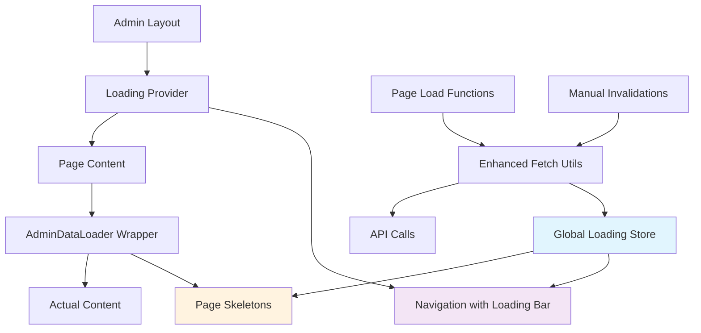

# Admin Loading Indicators Implementation Plan

## Overview
This document outlines the comprehensive implementation plan for integrated, homogeneous visual indicators across the admin interface in the copilot-survey application.

## Current State Analysis

### Issues Identified
1. **Inconsistent Loading Patterns**:
   - `/admin/accounts` uses detailed skeleton loading
   - `/admin/tokens` uses simple text loading
   - `/admin/areas` shows no loading state
   - `/admin` dashboard has local loading state but no visual indicator

2. **No Global Loading State**: The admin layout has no awareness of page loading states

3. **Manual Invalidation**: Using `invalidate()` calls without loading feedback

## Implementation Architecture



## Phase 1: Global Loading State Management

### 1.1 Global Loading Store
**File**: `src/lib/stores/admin-loading.ts`

```typescript
import { writable, derived } from 'svelte/store';

interface LoadingOperation {
  id: string;
  type: 'navigation' | 'data' | 'action';
  description?: string;
}

interface AdminLoadingState {
  operations: LoadingOperation[];
  isLoading: boolean;
  hasNavigationLoading: boolean;
  hasDataLoading: boolean;
}

// Core loading store
const adminLoadingState = writable<AdminLoadingState>({
  operations: [],
  isLoading: false,
  hasNavigationLoading: false,
  hasDataLoading: false
});

// Derived stores for specific use cases
export const isAdminLoading = derived(
  adminLoadingState,
  ($state) => $state.isLoading
);

export const isNavigationLoading = derived(
  adminLoadingState,
  ($state) => $state.hasNavigationLoading
);

export const isDataLoading = derived(
  adminLoadingState,
  ($state) => $state.hasDataLoading
);

// Store management functions
export const adminLoading = {
  subscribe: adminLoadingState.subscribe,
  
  startOperation: (operation: LoadingOperation) => {
    adminLoadingState.update(state => {
      const newOperations = [...state.operations, operation];
      return {
        operations: newOperations,
        isLoading: newOperations.length > 0,
        hasNavigationLoading: newOperations.some(op => op.type === 'navigation'),
        hasDataLoading: newOperations.some(op => op.type === 'data')
      };
    });
  },
  
  endOperation: (operationId: string) => {
    adminLoadingState.update(state => {
      const newOperations = state.operations.filter(op => op.id !== operationId);
      return {
        operations: newOperations,
        isLoading: newOperations.length > 0,
        hasNavigationLoading: newOperations.some(op => op.type === 'navigation'),
        hasDataLoading: newOperations.some(op => op.type === 'data')
      };
    });
  },
  
  clear: () => {
    adminLoadingState.set({
      operations: [],
      isLoading: false,
      hasNavigationLoading: false,
      hasDataLoading: false
    });
  }
};
```

### 1.2 Loading Context Provider
**File**: `src/lib/components/admin/LoadingProvider.svelte`

```svelte
<script lang="ts">
  import { adminLoading } from '$lib/stores/admin-loading';
  import { onMount } from 'svelte';
  import { navigating } from '$app/stores';
  
  let { children } = $props();
  
  // Track navigation loading automatically
  $effect(() => {
    if ($navigating) {
      adminLoading.startOperation({
        id: 'navigation',
        type: 'navigation',
        description: 'Navigating...'
      });
    } else {
      adminLoading.endOperation('navigation');
    }
  });
  
  // Clear loading state on unmount
  onMount(() => {
    return () => adminLoading.clear();
  });
</script>

{@render children()}
```

## Phase 2: Navigation Loading Indicator

### 2.1 Navigation Loading Bar Component
**File**: `src/lib/components/admin/NavigationLoadingBar.svelte`

```svelte
<script lang="ts">
  import { isNavigationLoading, isDataLoading } from '$lib/stores/admin-loading';
  
  $: showLoadingBar = $isNavigationLoading || $isDataLoading;
</script>

{#if showLoadingBar}
  <div class="fixed top-0 left-0 right-0 z-50">
    <div class="h-1 bg-primary/20">
      <div class="h-full bg-primary animate-pulse origin-left scale-x-100 transition-transform duration-300"></div>
    </div>
  </div>
{/if}

<style>
  @keyframes loadingBar {
    0% { transform: scaleX(0); }
    50% { transform: scaleX(0.7); }
    100% { transform: scaleX(1); }
  }
  
  .animate-loading-bar {
    animation: loadingBar 2s ease-in-out infinite;
  }
</style>
```

### 2.2 Enhanced Admin Layout
**File**: `src/routes/admin/+layout.svelte` (modifications)

```svelte
<script lang="ts">
  import ProfileWidget from "$components/ProfileWidget.svelte";
  import * as Breadcrumb from "$lib/components/ui/breadcrumb/index.js";
  import { Button } from "$lib/components/ui/button/index.js";
  import { page } from "$app/stores";
  import { Home, Settings, Users, MapPin, Briefcase, Key } from "lucide-svelte";
  import LoadingProvider from "$lib/components/admin/LoadingProvider.svelte";
  import NavigationLoadingBar from "$lib/components/admin/NavigationLoadingBar.svelte";
  import { isNavigationLoading } from "$lib/stores/admin-loading";
  
  let { children, data } = $props();

  // Navigation items with icons and paths
  const navItems = [
    { label: "Dashboard", path: "/admin", icon: Home },
    { label: "Tokens", path: "/admin/tokens", icon: Key },
    { label: "Accounts", path: "/admin/accounts", icon: Users },
    { label: "Areas", path: "/admin/areas", icon: MapPin },
    { label: "Jobs", path: "/admin/jobs", icon: Briefcase },
    { label: "Settings", path: "/admin/settings", icon: Settings }
  ];

  // Derived current page info
  const currentPath = $derived($page.url.pathname);
  const currentNavItem = $derived(navItems.find(item =>
    item.path === currentPath ||
    (item.path !== "/admin" && currentPath.startsWith(item.path))
  ) || navItems[0]);
</script>

<LoadingProvider>
  <div class="min-h-screen bg-background">
    <NavigationLoadingBar />
    
    <!-- Main navigation -->
    <nav class="border-b bg-muted/40">
      <div class="container mx-auto px-4">
        <!-- Breadcrumb navigation with loading indicator -->
        <div class="flex items-center justify-between py-4">
          <div class="flex items-center gap-4">
            <Breadcrumb.Root>
              <Breadcrumb.List>
                <Breadcrumb.Item>
                  <Breadcrumb.Link href="/">Home</Breadcrumb.Link>
                </Breadcrumb.Item>
                <Breadcrumb.Separator />
                <Breadcrumb.Item>
                  <Breadcrumb.Link href="/admin">Admin</Breadcrumb.Link>
                </Breadcrumb.Item>
                {#if currentPath !== "/admin" && currentNavItem}
                  <Breadcrumb.Separator />
                  <Breadcrumb.Item>
                    <Breadcrumb.Page class="flex items-center">
                      {@const IconComponent = currentNavItem.icon}
                      <IconComponent class="mr-2 h-4 w-4" />
                      {currentNavItem.label}
                    </Breadcrumb.Page>
                  </Breadcrumb.Item>
                {/if}
              </Breadcrumb.List>
            </Breadcrumb.Root>
            
            <!-- Loading indicator in breadcrumb area -->
            {#if $isNavigationLoading}
              <div class="flex items-center text-muted-foreground">
                <div class="animate-spin h-4 w-4 border-2 border-primary border-t-transparent rounded-full mr-2"></div>
                <span class="text-sm">Loading...</span>
              </div>
            {/if}
          </div>
        </div>
        
        <!-- Navigation buttons with loading states -->
        <div class="flex flex-wrap gap-2 pb-4">
          {#if !currentPath.endsWith("/sign-in")}
            {#each navItems as item (item.path)}
              <Button
                variant={currentPath === item.path || (item.path !== "/admin" && currentPath.startsWith(item.path)) ? "default" : "outline"}
                size="sm"
                href={item.path}
                class="flex items-center gap-2"
                disabled={$isNavigationLoading}
              >
                {@const IconComponent = item.icon}
                <IconComponent class="h-4 w-4" />
                {item.label}
              </Button>
            {/each}
          {:else}
            <Button
              variant="outline"
              size="sm"
              href="/"
              class="flex items-center gap-2"
              disabled={$isNavigationLoading}
            >
              <Home class="h-4 w-4" />
              Home
            </Button>
          {/if}

          <div class="grow"></div>
          <div class="card">
            <ProfileWidget user={data.user} class="mb-0 [&_button]:py-2" />
          </div>
        </div>
      </div>
    </nav>

    <!-- Main content area -->
    <main class="container mx-auto px-4 py-8">
      {@render children()}
    </main>
  </div>
</LoadingProvider>
```

## Phase 3: Standardized Skeleton Components

### 3.1 Admin Page Skeleton
**File**: `src/lib/components/admin/skeletons/AdminPageSkeleton.svelte`

```svelte
<script lang="ts">
  import { Skeleton } from "$lib/components/ui/skeleton";
  
  let { 
    title = true,
    description = true,
    headerAction = false,
    children
  } = $props();
</script>

<div class="space-y-6">
  {#if title || description}
    <div class="space-y-2">
      {#if title}
        <Skeleton class="h-8 w-64" />
      {/if}
      {#if description}
        <Skeleton class="h-4 w-96" />
      {/if}
      {#if headerAction}
        <Skeleton class="h-10 w-32" />
      {/if}
    </div>
  {/if}
  
  {#if children}
    {@render children()}
  {/if}
</div>
```

### 3.2 Table Skeleton
**File**: `src/lib/components/admin/skeletons/TableSkeleton.svelte`

```svelte
<script lang="ts">
  import { Skeleton } from "$lib/components/ui/skeleton";
  
  let { 
    columns = 5,
    rows = 10,
    hasHeader = true,
    hasActions = true
  } = $props();
  
  const headerWidths = ["w-1/4", "w-1/3", "w-1/5", "w-1/6", "w-1/8"];
  const cellWidths = ["w-2/3", "w-3/4", "w-1/2", "w-5/6", "w-4/5"];
</script>

<div class="space-y-4">
  <!-- Table header skeleton -->
  {#if hasHeader}
    <div class="grid gap-4" style="grid-template-columns: repeat({columns}, 1fr)">
      {#each Array(columns) as _, i}
        <Skeleton class="h-4 {headerWidths[i % headerWidths.length]}" />
      {/each}
    </div>
    <Skeleton class="h-px w-full" />
  {/if}
  
  <!-- Table rows skeleton -->
  {#each Array(rows) as _, rowIndex}
    <div class="grid gap-4 py-2" style="grid-template-columns: repeat({columns}, 1fr)">
      {#each Array(columns) as _, colIndex}
        {#if hasActions && colIndex === columns - 1}
          <div class="flex gap-2">
            <Skeleton class="h-8 w-16" />
            <Skeleton class="h-8 w-16" />
          </div>
        {:else}
          <Skeleton class="h-4 {cellWidths[colIndex % cellWidths.length]}" />
        {/if}
      {/each}
    </div>
  {/each}
</div>
```

### 3.3 Stats Card Skeleton
**File**: `src/lib/components/admin/skeletons/StatsCardSkeleton.svelte`

```svelte
<script lang="ts">
  import * as Card from "$lib/components/ui/card/index.js";
  import { Skeleton } from "$lib/components/ui/skeleton";
  
  let { count = 4 } = $props();
</script>

<div class="grid gap-6 md:grid-cols-2 lg:grid-cols-4">
  {#each Array(count) as _}
    <Card.Root>
      <Card.Header class="flex flex-row items-center justify-between space-y-0 pb-2">
        <Skeleton class="h-4 w-20" />
        <Skeleton class="h-4 w-4" />
      </Card.Header>
      <Card.Content>
        <Skeleton class="h-8 w-16" />
        <Skeleton class="h-3 w-24 mt-2" />
      </Card.Content>
    </Card.Root>
  {/each}
</div>
```

### 3.4 Card Grid Skeleton
**File**: `src/lib/components/admin/skeletons/CardGridSkeleton.svelte`

```svelte
<script lang="ts">
  import * as Card from "$lib/components/ui/card/index.js";
  import { Skeleton } from "$lib/components/ui/skeleton";
  
  let { 
    count = 6,
    columns = 3,
    hasActions = true
  } = $props();
</script>

<div class="grid gap-4 md:grid-cols-2 lg:grid-cols-{columns}">
  {#each Array(count) as _}
    <Card.Root>
      <Card.Header>
        <div class="flex items-center gap-2">
          <Skeleton class="h-5 w-5" />
          <Skeleton class="h-5 w-32" />
        </div>
        <Skeleton class="h-4 w-48 mt-2" />
      </Card.Header>
      {#if hasActions}
        <Card.Content>
          <Skeleton class="h-10 w-full" />
        </Card.Content>
      {/if}
    </Card.Root>
  {/each}
</div>
```

## Phase 4: Data Loading Wrapper

### 4.1 Admin Data Loader Component
**File**: `src/lib/components/admin/AdminDataLoader.svelte`

```svelte
<script lang="ts">
  import { adminLoading } from '$lib/stores/admin-loading';
  import { onMount } from 'svelte';
  import AdminPageSkeleton from './skeletons/AdminPageSkeleton.svelte';
  import TableSkeleton from './skeletons/TableSkeleton.svelte';
  import StatsCardSkeleton from './skeletons/StatsCardSkeleton.svelte';
  import CardGridSkeleton from './skeletons/CardGridSkeleton.svelte';
  
  let {
    data,
    loadingType = 'page',
    operationId = crypto.randomUUID(),
    errorMessage = 'Failed to load data',
    children,
    fallback
  }: {
    data: Promise<any>;
    loadingType?: 'page' | 'table' | 'stats' | 'cards';
    operationId?: string;
    errorMessage?: string;
    children: any;
    fallback?: any;
  } = $props();
  
  onMount(() => {
    adminLoading.startOperation({
      id: operationId,
      type: 'data',
      description: 'Loading data...'
    });
    
    return () => {
      adminLoading.endOperation(operationId);
    };
  });
  
  function getSkeletonComponent(type: string) {
    switch (type) {
      case 'table': return TableSkeleton;
      case 'stats': return StatsCardSkeleton;
      case 'cards': return CardGridSkeleton;
      default: return AdminPageSkeleton;
    }
  }
  
  const SkeletonComponent = getSkeletonComponent(loadingType);
</script>

{#await data}
  {#if fallback}
    {@render fallback()}
  {:else}
    <SkeletonComponent />
  {/if}
{:then resolvedData}
  {@render children({ data: resolvedData })}
{:catch error}
  <div class="text-center py-8">
    <div class="text-destructive mb-2">{errorMessage}</div>
    <div class="text-sm text-muted-foreground">{error.message}</div>
  </div>
{/await}
```

## Phase 5: Enhanced Fetch Utilities

### 5.1 Admin Fetch Utilities
**File**: `src/lib/utils/admin-fetch.ts`

```typescript
import { adminLoading } from '$lib/stores/admin-loading';
import { authClient } from '$lib/auth-client';

interface FetchOptions {
  operationId?: string;
  description?: string;
  showLoading?: boolean;
}

export async function fetchAdminData(
  _fetch: typeof fetch,
  part: string,
  token?: string | Promise<string | undefined>,
  options: FetchOptions = {}
) {
  const { 
    operationId = `fetch-${part}-${Date.now()}`,
    description = `Loading ${part}...`,
    showLoading = true
  } = options;
  
  if (typeof token !== "string") token = await token;
  
  if (showLoading) {
    adminLoading.startOperation({
      id: operationId,
      type: 'data',
      description
    });
  }
  
  try {
    const response = await _fetch(`/api/admin/${part}`, {
      method: "GET",
      headers: {
        Authorization: `Bearer ${token}`
      }
    });
    
    if (!response.ok) {
      throw new Error(`Failed to fetch ${part}: ${response.statusText}`);
    }
    
    const data = await response.json();
    return data;
  } catch (error) {
    console.error(`Failed to fetch ${part}:`, error);
    throw error;
  } finally {
    if (showLoading) {
      adminLoading.endOperation(operationId);
    }
  }
}

export async function invalidateWithLoading(
  invalidateFn: () => Promise<void>,
  description = 'Refreshing data...'
) {
  const operationId = `invalidate-${Date.now()}`;
  
  adminLoading.startOperation({
    id: operationId,
    type: 'data',
    description
  });
  
  try {
    await invalidateFn();
  } finally {
    adminLoading.endOperation(operationId);
  }
}
```

## Phase 6: Updated Page Implementations

### 6.1 Enhanced Dashboard Page
**File**: `src/routes/admin/+page.svelte` (updated)

```svelte
<script lang="ts">
  import * as Card from "$lib/components/ui/card/index.js";
  import * as Alert from "$lib/components/ui/alert/index.js";
  import { Button } from "$lib/components/ui/button/index.js";
  import Input from "@/input/input.svelte";
  import { m } from "$paraglide";
  import { Users, Key, MapPin, Briefcase, Settings, CircleAlert, RefreshCw, ClipboardCopy, DatabaseBackup, FileDown, ArchiveRestore } from "lucide-svelte";
  import Time from "svelte-time/Time.svelte";
  import { invalidate } from "$app/navigation";
  import type { PageProps } from "./$types";
  import { clickToCopy, dynamicHandleDownloadAsCSV } from "$lib/utils";
  import { toast } from "svelte-sonner";
  import LoadingButton from "$lib/components/LoadingButton.svelte";
  import { authClient } from "$lib/auth-client";
  import { goto } from "$app/navigation";
  import AdminDataLoader from "$lib/components/admin/AdminDataLoader.svelte";
  import StatsCardSkeleton from "$lib/components/admin/skeletons/StatsCardSkeleton.svelte";
  import { invalidateWithLoading } from "$lib/utils/admin-fetch";
  
  let { data }: PageProps = $props();

  // Hash generator state
  let toBeHashed = $state(data.user?.email ?? "");
  let hashedValue = $state("");

  async function hashValue() {
    try {
      const response = await fetch("/api/admin/hash", {
        method: "POST",
        headers: { "Content-Type": "application/json" },
        body: JSON.stringify({ value: toBeHashed })
      });
      const result: any = await response.json();
      if (result.error || !result.success) {
        toast.error("Error hashing value", { description: result.error });
        hashedValue = result.error;
      } else {
        hashedValue = result.hashedValue;
      }
    } catch (error) {
      toast.error("Failed to hash value", {
        description: error instanceof Error ? error.message : "Unknown error"
      });
    }
  }

  // Account management functions
  async function backupAccounts() {
    const token = (await authClient.getSession())?.data?.session.token;
    if (!token) return goto("/admin/sign-in");
    await fetch("/api/admin/backup", {
      headers: {
        Authorization: `Bearer ${token}`
      }
    });
    toast.success("Backup initiated", { description: "Backup email will be sent" });
  }

  async function copyAccountIds() {
    const users = await data.users;
    if (Array.isArray(users)) {
      const idsText = users.map((x: any) => x.email).join("\n");
      navigator.clipboard.writeText(idsText);
      toast.success("Account IDs copied", { description: "Email addresses copied to clipboard" });
    }
  }

  async function exportAccountsCSV() {
    const users = await data.users;
    if (Array.isArray(users)) {
      dynamicHandleDownloadAsCSV(() =>
        users.map((x: any) => ({
          email: x.email,
          accounts: x.accounts.map((acc: any) => acc.providerId).join(",")
        }))
      )();
      toast.success("CSV export started", { description: "Download should begin shortly" });
    }
  }

  // Enhanced refresh function
  async function refreshCrawlerStatus() {
    await invalidateWithLoading(
      () => invalidate("/api/admin/crawler"),
      'Refreshing crawler status...'
    );
  }

  // Summary stats derived from data
  const summaryStats = $derived.by(async () => {
    const [users, areas, jobs, tokenInfos] = await Promise.all([
      data.users,
      data.areas,
      data.jobs,
      data.tokenInfos
    ]);

    return {
      users: Array.isArray(users) ? users.length : 0,
      areas: Array.isArray(areas) ? areas.length : 0,
      jobs: Array.isArray(jobs) ? jobs.length : 0,
      tokens: (tokenInfos && typeof tokenInfos === 'object' && 'result' in tokenInfos && tokenInfos.result)
        ? Object.keys(tokenInfos.result).length : 0
    };
  });

  const quickActions = [
    { label: "Manage Tokens", href: "/admin/tokens", icon: Key, description: "View and manage API tokens" },
    { label: "User Accounts", href: "/admin/accounts", icon: Users, description: "Manage user accounts and permissions" },
    { label: "Survey Areas", href: "/admin/areas", icon: MapPin, description: "Configure survey areas and regions" },
    { label: "Job Management", href: "/admin/jobs", icon: Briefcase, description: "Monitor and manage jobs" },
    { label: "System Settings", href: "/admin/settings", icon: Settings, description: "Configure application settings" }
  ];
</script>

<div class="space-y-8">
  <!-- Page Header -->
  <div>
    <h1 class="text-4xl font-extrabold">{m["admin.dashboard.title"]()}</h1>
    <p class="text-muted-foreground mt-2">Overview of your admin dashboard</p>
  </div>

  <!-- Summary Cards with Loading -->
  <AdminDataLoader 
    data={summaryStats} 
    loadingType="stats"
    operationId="dashboard-stats"
    errorMessage="Failed to load dashboard statistics"
  >
    {#snippet children({ data: stats })}
      <div class="grid gap-6 md:grid-cols-2 lg:grid-cols-4">
        <Card.Root>
          <Card.Header class="flex flex-row items-center justify-between space-y-0 pb-2">
            <Card.Title class="text-sm font-medium">Total Users</Card.Title>
            <Users class="h-4 w-4 text-muted-foreground" />
          </Card.Header>
          <Card.Content>
            <div class="text-2xl font-bold">{stats.users}</div>
            <p class="text-xs text-muted-foreground">Registered accounts</p>
          </Card.Content>
        </Card.Root>

        <Card.Root>
          <Card.Header class="flex flex-row items-center justify-between space-y-0 pb-2">
            <Card.Title class="text-sm font-medium">Active Tokens</Card.Title>
            <Key class="h-4 w-4 text-muted-foreground" />
          </Card.Header>
          <Card.Content>
            <div class="text-2xl font-bold">{stats.tokens}</div>
            <p class="text-xs text-muted-foreground">API tokens configured</p>
          </Card.Content>
        </Card.Root>

        <Card.Root>
          <Card.Header class="flex flex-row items-center justify-between space-y-0 pb-2">
            <Card.Title class="text-sm font-medium">Survey Areas</Card.Title>
            <MapPin class="h-4 w-4 text-muted-foreground" />
          </Card.Header>
          <Card.Content>
            <div class="text-2xl font-bold">{stats.areas}</div>
            <p class="text-xs text-muted-foreground">Configured areas</p>
          </Card.Content>
        </Card.Root>

        <Card.Root>
          <Card.Header class="flex flex-row items-center justify-between space-y-0 pb-2">
            <Card.Title class="text-sm font-medium">Total Jobs</Card.Title>
            <Briefcase class="h-4 w-4 text-muted-foreground" />
          </Card.Header>
          <Card.Content>
            <div class="text-2xl font-bold">{stats.jobs}</div>
            <p class="text-xs text-muted-foreground">Jobs in system</p>
          </Card.Content>
        </Card.Root>
      </div>
    {/snippet}
  </AdminDataLoader>

  <!-- Account Management Quick Actions -->
  <Card.Root>
    <Card.Header>
      <Card.Title>Account Management</Card.Title>
      <Card.Description>Quick actions for user account management</Card.Description>
    </Card.Header>
    <Card.Content>
      <div class="flex flex-wrap gap-4">
        <LoadingButton
          variant="secondary"
          icon={ArchiveRestore}
          fn={backupAccounts}
        >
          Backup (Mail)
        </LoadingButton>
        <Button
          target="_blank"
          href="/admin/backup">
          <DatabaseBackup class="h-4 w-4 mr-2" />
          Backup
        </Button>
        <Button
          variant="secondary"
          onclick={copyAccountIds}>
          <ClipboardCopy class="h-4 w-4 mr-2" />
          Copy IDs
        </Button>
        <Button
          variant="default"
          onclick={exportAccountsCSV}
        >
          <FileDown class="h-4 w-4 mr-2" />
          CSV Export
        </Button>
      </div>
    </Card.Content>
  </Card.Root>

  <!-- Hash Generator -->
  <Card.Root>
    <Card.Header>
      <Card.Title>Hash Generator</Card.Title>
      <Card.Description>Generate hashed values for secure storage and comparison</Card.Description>
    </Card.Header>
    <Card.Content class="space-y-4">
      <div class="flex flex-row gap-4">
        <Input
          type="text"
          bind:value={toBeHashed}
          class="font-mono flex-1"
          placeholder="Value to hash"
        />
        <Button onclick={hashValue}>
          Hash Value
        </Button>
      </div>

      <div
        class="flex flex-wrap flex-row cursor-pointer font-mono border-2 border-slate-300 p-2 rounded-md min-h-[2.5rem] items-center"
        use:clickToCopy={hashedValue}
      >
        <ClipboardCopy
          color={hashedValue && hashedValue.length > 0 ? '#000000' : '#9ca3af'}
          class="mr-2 flex-shrink-0"
        />
        <span class="break-all">{hashedValue || "Hashed value will appear here..."}</span>
      </div>
      
      {#if hashedValue}
        <p class="text-xs text-muted-foreground">
          Click the box above to copy the hashed value to clipboard.
        </p>
      {/if}
    </Card.Content>
  </Card.Root>

  <!-- Quick Actions -->
  <div>
    <h2 class="text-2xl font-semibold mb-6">Quick Actions</h2>
    <div class="grid gap-4 md:grid-cols-2 lg:grid-cols-3">
      {#each quickActions as action (action.href)}
        <Card.Root class="hover:shadow-md transition-shadow">
          <Card.Header>
            <Card.Title class="flex items-center gap-2">
              {@const IconComponent = action.icon}
              <IconComponent class="h-5 w-5" />
              {action.label}
            </Card.Title>
            <Card.Description>{action.description}</Card.Description>
          </Card.Header>
          <Card.Content>
            <Button href={action.href} class="w-full">
              Go to {action.label}
            </Button>
          </Card.Content>
        </Card.Root>
      {/each}
    </div>
  </div>
</div>
```

### 6.2 Enhanced Accounts Page
**File**: `src/routes/admin/accounts/+page.svelte` (updated)

```svelte
<script lang="ts">
  import UserTable from "$lib/components/UserTable.svelte";
  import AdminDataLoader from "$lib/components/admin/AdminDataLoader.svelte";
  
  let { data } = $props();
</script>

<div class="space-y-6">
  <!-- Page Header -->
  <div>
    <h1 class="text-3xl font-bold">User Accounts</h1>
    <p class="text-muted-foreground mt-2">Manage user accounts and permissions</p>
  </div>

  <!-- Users Table with Consistent Loading -->
  <AdminDataLoader 
    data={data.users} 
    loadingType="table"
    operationId="users-table"
    errorMessage="Failed to load user accounts"
  >
    {#snippet children({ data: users })}
      {#if users && Array.isArray(users)}
        <UserTable users={users as any[]} />
      {:else}
        <div class="text-center py-8 text-muted-foreground">
          No user data available
        </div>
      {/if}
    {/snippet}
  </AdminDataLoader>
</div>
```

### 6.3 Enhanced Tokens Page
**File**: `src/routes/admin/tokens/+page.svelte` (updated)

```svelte
<script lang="ts">
  import TokensInfo from "$components/TokensInfo.svelte";
  import AdminDataLoader from "$lib/components/admin/AdminDataLoader.svelte";
  
  let { data } = $props();
</script>

<div class="space-y-6">
  <!-- Page Header -->
  <div>
    <h1 class="text-3xl font-bold">Tokens</h1>
    <p class="text-muted-foreground mt-2">Manage API tokens</p>
  </div>

  <!-- Token Information with Consistent Loading -->
  <div class="space-y-4">
    <h2 class="text-xl font-semibold">Token Information</h2>
    <AdminDataLoader 
      data={data.tokenInfos} 
      loadingType="page"
      operationId="token-infos"
      errorMessage="Failed to load token information"
    >
      {#snippet children({ data: tokenInfos })}
        <TokensInfo infos={(tokenInfos as any).result} />
      {/snippet}
    </AdminDataLoader>
  </div>
</div>
```

## Implementation Timeline

### Week 1: Foundation
- [ ] Create global loading store
- [ ] Implement loading provider
- [ ] Add navigation loading bar
- [ ] Update admin layout

### Week 2: Skeleton Components
- [ ] Build all skeleton components
- [ ] Create AdminDataLoader wrapper
- [ ] Test skeleton components

### Week 3: Enhanced Utilities
- [ ] Implement enhanced fetch utilities
- [ ] Create invalidation helpers
- [ ] Update existing fetch calls

### Week 4: Page Updates
- [ ] Update dashboard page
- [ ] Update accounts page
- [ ] Update tokens page
- [ ] Update remaining admin pages

### Week 5: Testing & Polish
- [ ] End-to-end testing
- [ ] Performance optimization
- [ ] Documentation updates
- [ ] Bug fixes and refinements

## Success Criteria

✅ **Consistency**: All admin pages show the same type of loading indicators
✅ **User Feedback**: Users always know when data is being fetched
✅ **Performance**: Loading states don't impact app performance
✅ **Maintainability**: Easy to add loading states to new pages
✅ **Accessibility**: Loading states are accessible to screen readers

## Technical Benefits

1. **Centralized State Management**: Single source of truth for loading states
2. **Reusable Components**: Skeleton components can be used across the app
3. **Enhanced UX**: Consistent, predictable loading experience
4. **Developer Experience**: Easy to implement loading states
5. **Performance**: Perceived performance improvement through skeleton loading

This implementation plan provides a comprehensive solution for homogeneous loading indicators across the admin interface, ensuring a consistent and professional user experience.