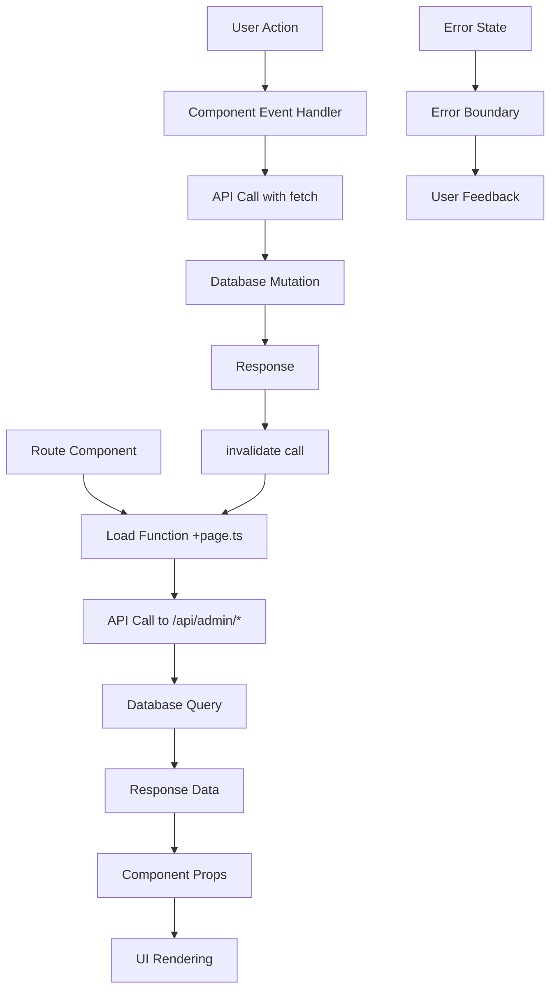

# Admin Backend Refactoring Architecture Plan

## Overview

This document outlines the comprehensive architecture for refactoring the admin backend from a tab-based interface to a proper route-based structure with enhanced job management capabilities.

## Current State Analysis

The current admin interface is implemented as a single page (`/admin`) with a tab-based UI using Shadcn/UI Tabs component. Each tab loads data independently:

- **Tokens**: Token information and hashing utility
- **Accounts**: User management table  
- **Areas**: Areas management table
- **Jobs**: Jobs display (currently read-only)
- **Settings**: YAML configuration editor

### Current File Structure
```
src/routes/admin/
├── +layout.svelte (minimal layout)
├── +page.svelte (monolithic tab interface)
├── +page.ts (loads all admin data)
└── +layout.server.ts (auth check)
```

## 1. Route Structure Design

### New Route Hierarchy
```
/admin (main dashboard/overview)
├── /admin/tokens (tokens management)
├── /admin/accounts (user management) 
├── /admin/areas (areas management)
├── /admin/jobs (enhanced jobs management)
└── /admin/settings (settings management)
```

### Route Implementation Strategy

#### File Structure After Refactoring
```
src/routes/admin/
├── +layout.svelte (enhanced shared layout)
├── +layout.server.ts (existing auth check)
├── +page.svelte (new dashboard overview)
├── +page.ts (dashboard data only)
├── tokens/
│   ├── +page.svelte
│   └── +page.ts
├── accounts/
│   ├── +page.svelte
│   └── +page.ts
├── areas/
│   ├── +page.svelte
│   └── +page.ts
├── jobs/
│   ├── +page.svelte
│   ├── +page.ts
│   └── components/
│       ├── JobActionsMenu.svelte
│       ├── BulkActionsToolbar.svelte
│       ├── DeleteJobDialog.svelte
│       └── BulkDeleteDialog.svelte
└── settings/
    ├── +page.svelte
    └── +page.ts
```

#### Data Loading Strategy
- **Route-specific loading**: Each admin route loads only its required data
- **Preserve existing patterns**: Use same `fetchAdminData` function pattern
- **Shared data caching**: Common data (like user session) loaded at layout level
- **Progressive enhancement**: Data loads incrementally, with loading states

```typescript
// Example: src/routes/admin/jobs/+page.ts
import { authClient } from "$lib/auth-client";

export async function load(event) {
  const token = authClient.getSession().then((response) => response.data?.session.token);
  
  return {
    jobs: fetchAdminData(event.fetch, "jobs", token),
    sessiontoken: token
  };
}
```

## 2. Component Architecture

### Shared Admin Layout Component

```svelte
<!-- src/routes/admin/+layout.svelte (enhanced) -->
<script lang="ts">
  import AdminNavigation from "$lib/components/admin/AdminNavigation.svelte";
  import AdminBreadcrumb from "$lib/components/admin/AdminBreadcrumb.svelte";
  import ProfileWidget from "$components/ProfileWidget.svelte";
  
  let { data, children } = $props();
</script>

<div class="admin-layout">
  <ProfileWidget user={data.user} class="mb-4" />
  <h1 class="mb-2 text-4xl font-extrabold">Admin Dashboard</h1>
  
  <AdminNavigation />
  <AdminBreadcrumb />
  
  <main class="admin-content">
    {@render children()}
  </main>
</div>
```

### Page Component Extraction

Current tab content will be extracted into dedicated page components:

```
src/lib/components/admin/
├── pages/
│   ├── TokensPage.svelte (extracted from tokens tab)
│   ├── AccountsPage.svelte (extracted from accounts tab) 
│   ├── AreasPage.svelte (extracted from areas tab)
│   ├── JobsPage.svelte (enhanced jobs management)
│   ├── SettingsPage.svelte (extracted from settings tab)
│   └── DashboardPage.svelte (new overview page)
├── navigation/
│   ├── AdminNavigation.svelte
│   └── AdminBreadcrumb.svelte
└── jobs/
    ├── EnhancedJobsTable.svelte
    ├── JobActionsMenu.svelte
    ├── BulkActionsToolbar.svelte
    ├── DeleteJobDialog.svelte
    ├── BulkDeleteDialog.svelte
    └── JobsFilters.svelte
```

### Enhanced JobsTable Component

The existing `JobsTable.svelte` will be enhanced with:

- **Individual delete buttons** per job row
- **Bulk selection checkboxes** with master select/deselect
- **Bulk action toolbar** appearing when jobs are selected
- **Confirmation dialogs** for both individual and bulk operations
- **Status filtering** and **search functionality**

#### Component Structure
```svelte
<!-- Enhanced JobsTable structure -->
<div class="jobs-management">
  <!-- Bulk Actions Toolbar (appears when jobs selected) -->
  {#if selectedJobs.length > 0}
    <BulkActionsToolbar 
      selectedJobs={selectedJobIds}
      onBulkDelete={handleBulkDelete}
      onClearSelection={clearSelection}
    />
  {/if}
  
  <!-- Filters and Search -->
  <JobsFilters bind:filters onFilterChange={handleFilterChange} />
  
  <!-- Enhanced Table with Actions Column -->
  <Table.Root>
    <Table.Header>
      <Table.Row>
        <!-- Master checkbox for select all -->
        <Table.Head class="w-12">
          <Checkbox 
            bind:checked={selectAll} 
            onchange={handleSelectAll}
            indeterminate={someSelected && !allSelected}
          />
        </Table.Head>
        <!-- Existing headers -->
        <Table.Head>ID</Table.Head>
        <Table.Head>Command</Table.Head>
        <Table.Head>Provider</Table.Head>
        <Table.Head>Status</Table.Head>
        <Table.Head>Updated</Table.Head>
        <Table.Head>Started</Table.Head>
        <Table.Head>Finished</Table.Head>
        <Table.Head>Details</Table.Head>
        <!-- New Actions column -->
        <Table.Head class="w-20">Actions</Table.Head>
      </Table.Row>
    </Table.Header>
    <Table.Body>
      {#each filteredJobs as job}
        <Table.Row>
          <!-- Individual checkbox -->
          <Table.Cell>
            <Checkbox bind:checked={selectedJobIds[job.id]} />
          </Table.Cell>
          <!-- Existing content cells -->
          <!-- ... existing cells ... -->
          <!-- Actions cell -->
          <Table.Cell>
            <JobActionsMenu {job} onDelete={handleSingleDelete} />
          </Table.Cell>
        </Table.Row>
      {/each}
    </Table.Body>
  </Table.Root>
</div>
```

## 3. API Design

### New Job Management Endpoints

#### Individual Job Deletion
```typescript
// DELETE /api/admin/jobs/[id]/+server.ts
export async function DELETE({ params, locals }) {
  if (!locals.session || !locals.user?.id || locals.user.role !== "admin") {
    return json({ error: "Unauthorized!" }, { status: 401 });
  }

  const jobId = params.id;
  
  try {
    // Check if job exists and can be deleted
    const jobToDelete = await db.query.job.findFirst({
      where: eq(job.id, jobId)
    });
    
    if (!jobToDelete) {
      return json({ error: "Job not found" }, { status: 404 });
    }
    
    // Prevent deletion of running jobs
    if (jobToDelete.status === JobStatus.running) {
      return json({ 
        error: "Cannot delete running job. Please pause or wait for completion." 
      }, { status: 400 });
    }
    
    // Delete the job
    await db.delete(job).where(eq(job.id, jobId));
    
    return json({
      success: true,
      message: "Job deleted successfully",
      jobId: jobId
    });
    
  } catch (error) {
    console.error("Error deleting job:", error);
    return json({ error: "Failed to delete job" }, { status: 500 });
  }
}
```

#### Bulk Job Operations
```typescript
// DELETE /api/admin/jobs/bulk/+server.ts
export async function DELETE({ request, locals }) {
  if (!locals.session || !locals.user?.id || locals.user.role !== "admin") {
    return json({ error: "Unauthorized!" }, { status: 401 });
  }

  const { jobIds, filters } = await request.json();
  
  try {
    let jobsToDelete;
    
    if (jobIds && jobIds.length > 0) {
      // Delete specific jobs by ID
      jobsToDelete = await db.query.job.findMany({
        where: inArray(job.id, jobIds)
      });
    } else if (filters) {
      // Delete jobs based on filters
      jobsToDelete = await buildFilteredQuery(filters);
    } else {
      return json({ error: "No jobs specified for deletion" }, { status: 400 });
    }
    
    // Prevent deletion of running jobs
    const runningJobs = jobsToDelete.filter(j => j.status === JobStatus.running);
    if (runningJobs.length > 0) {
      return json({ 
        error: `Cannot delete ${runningJobs.length} running jobs. Please pause them first.`,
        runningJobIds: runningJobs.map(j => j.id)
      }, { status: 400 });
    }
    
    // Perform bulk deletion in transaction
    const deletableJobIds = jobsToDelete.map(j => j.id);
    const deleteResult = await db.delete(job)
      .where(inArray(job.id, deletableJobIds));
    
    return json({
      success: true,
      deletedCount: deletableJobIds.length,
      message: `Successfully deleted ${deletableJobIds.length} jobs`
    });
    
  } catch (error) {
    console.error("Error in bulk delete:", error);
    return json({ error: "Failed to delete jobs" }, { status: 500 });
  }
}
```

#### Enhanced Job Listing
```typescript
// Enhanced GET /api/admin/jobs/+server.ts
export async function GET({ url, locals }) {
  if (!locals.session || !locals.user?.id || locals.user.role !== "admin") {
    return json({ error: "Unauthorized!" }, { status: 401 });
  }

  // Parse query parameters for filtering
  const status = url.searchParams.getAll('status');
  const command = url.searchParams.getAll('command');
  const provider = url.searchParams.getAll('provider');
  const limit = Number(url.searchParams.get('limit')) || 50;
  const offset = Number(url.searchParams.get('offset')) || 0;
  
  const jobs = await getJobsWithFilters({
    status: status.length > 0 ? status : undefined,
    command: command.length > 0 ? command : undefined,
    provider: provider.length > 0 ? provider : undefined,
    limit,
    offset
  });
  
  return json(jobs);
}
```

### API Implementation Pattern

- **Extend existing pattern**: Build on current `/api/admin/jobs/+server.ts`
- **Consistent auth checking**: Reuse existing admin role validation
- **Transaction safety**: Use database transactions for bulk operations
- **Error handling**: Comprehensive error responses with actionable messages
- **Input validation**: Validate all parameters and prevent dangerous operations

## 4. Data Flow Architecture

### State Management Pattern



### Data Loading Strategy

#### Route-Specific Loading
Each admin route will have focused data loading:

```typescript
// Dashboard: Overview metrics only
/admin/+page.ts -> loads summary stats

// Jobs: Full job data with pagination
/admin/jobs/+page.ts -> loads jobs with filtering

// Tokens: Token-specific data
/admin/tokens/+page.ts -> loads token information
```

#### State Invalidation Pattern
```typescript
// After job deletion
async function handleJobDelete(jobId: string) {
  try {
    const response = await fetch(`/api/admin/jobs/${jobId}`, {
      method: 'DELETE'
    });
    
    if (response.ok) {
      // Refresh jobs data
      await invalidate('/api/admin/jobs');
      toast.success('Job deleted successfully');
    } else {
      const error = await response.json();
      toast.error(error.message);
    }
  } catch (error) {
    toast.error('Failed to delete job');
  }
}
```

## 5. Job Management Features Design

### Enhanced JobsTable UI Components

#### Individual Job Actions
- **Delete button**: Trash icon in actions column
- **View details**: Eye icon to show full job information
- **Restart job**: Refresh icon for failed jobs (future enhancement)

#### Bulk Operations
- **Master checkbox**: Select/deselect all visible jobs
- **Individual checkboxes**: Per-row selection
- **Bulk toolbar**: Appears when jobs are selected
- **Action buttons**: Delete selected, Clear selection

#### Confirmation Dialogs

##### Individual Delete Confirmation
```svelte
<DeleteJobDialog bind:open={showDeleteDialog} {job}>
  <div slot="content">
    <p>Are you sure you want to delete this job?</p>
    <div class="job-details">
      <strong>ID:</strong> {job.id}<br>
      <strong>Command:</strong> {job.command}<br>
      <strong>Status:</strong> {job.status}<br>
      <strong>Provider:</strong> {job.provider}
    </div>
    <p class="warning">This action cannot be undone.</p>
  </div>
</DeleteJobDialog>
```

##### Bulk Delete Confirmation
```svelte
<BulkDeleteDialog bind:open={showBulkDialog} {selectedJobs}>
  <div slot="content">
    <p>You are about to delete <strong>{selectedJobs.length}</strong> jobs:</p>
    <ul class="job-summary">
      <li>Queued: {getCountByStatus('queued')}</li>
      <li>Failed: {getCountByStatus('failed')}</li>
      <li>Finished: {getCountByStatus('finished')}</li>
    </ul>
    <p class="warning">This action cannot be undone and will permanently remove all selected jobs and their data.</p>
  </div>
</BulkDeleteDialog>
```

### New Component Specifications

#### JobActionsMenu.svelte
```svelte
<script lang="ts">
  import { DropdownMenu } from "$ui/dropdown-menu";
  import { Button } from "$ui/button";
  import { MoreHorizontal, Trash2, Eye } from "lucide-svelte";
  
  type Props = {
    job: JobInformation;
    onDelete: (jobId: string) => void;
    onView?: (job: JobInformation) => void;
  };
  
  let { job, onDelete, onView }: Props = $props();
</script>

<DropdownMenu.Root>
  <DropdownMenu.Trigger asChild let:builder>
    <Button variant="ghost" builders={[builder]} size="sm">
      <MoreHorizontal class="h-4 w-4" />
    </Button>
  </DropdownMenu.Trigger>
  <DropdownMenu.Content>
    {#if onView}
      <DropdownMenu.Item on:click={() => onView?.(job)}>
        <Eye class="mr-2 h-4 w-4" />
        View Details
      </DropdownMenu.Item>
    {/if}
    <DropdownMenu.Item 
      on:click={() => onDelete(job.id)}
      class="text-destructive"
      disabled={job.status === 'running'}
    >
      <Trash2 class="mr-2 h-4 w-4" />
      Delete Job
    </DropdownMenu.Item>
  </DropdownMenu.Content>
</DropdownMenu.Root>
```

#### BulkActionsToolbar.svelte
```svelte
<script lang="ts">
  import { Button } from "$ui/button";
  import { Badge } from "$ui/badge";
  import { Trash2, X } from "lucide-svelte";
  
  type Props = {
    selectedJobs: string[];
    onBulkDelete: () => void;
    onClearSelection: () => void;
  };
  
  let { selectedJobs, onBulkDelete, onClearSelection }: Props = $props();
</script>

<div class="flex items-center justify-between p-4 bg-muted rounded-lg mb-4">
  <div class="flex items-center gap-2">
    <Badge variant="secondary">
      {selectedJobs.length} job{selectedJobs.length !== 1 ? 's' : ''} selected
    </Badge>
  </div>
  
  <div class="flex items-center gap-2">
    <Button variant="destructive" size="sm" onclick={onBulkDelete}>
      <Trash2 class="mr-2 h-4 w-4" />
      Delete Selected
    </Button>
    <Button variant="outline" size="sm" onclick={onClearSelection}>
      <X class="mr-2 h-4 w-4" />
      Clear Selection
    </Button>
  </div>
</div>
```

## 6. Navigation and User Experience

### Admin Navigation Component
```svelte
<!-- AdminNavigation.svelte -->
<nav class="admin-nav mb-6">
  <div class="flex space-x-1 rounded-lg bg-muted p-1">
    <a href="/admin" class="nav-link" class:active={isActive('/admin')}>
      Dashboard
    </a>
    <a href="/admin/tokens" class="nav-link" class:active={isActive('/admin/tokens')}>
      Tokens
    </a>
    <a href="/admin/accounts" class="nav-link" class:active={isActive('/admin/accounts')}>
      Accounts
    </a>
    <a href="/admin/areas" class="nav-link" class:active={isActive('/admin/areas')}>
      Areas
    </a>
    <a href="/admin/jobs" class="nav-link" class:active={isActive('/admin/jobs')}>
      Jobs
    </a>
    <a href="/admin/settings" class="nav-link" class:active={isActive('/admin/settings')}>
      Settings
    </a>
  </div>
</nav>

<style>
  .nav-link {
    @apply px-3 py-2 text-sm font-medium rounded-md transition-colors;
    @apply text-muted-foreground hover:text-foreground;
  }
  
  .nav-link.active {
    @apply bg-background text-foreground shadow-sm;
  }
</style>
```

### Breadcrumb Component
```svelte
<!-- AdminBreadcrumb.svelte -->
<nav class="breadcrumb mb-4">
  <ol class="flex items-center space-x-2 text-sm text-muted-foreground">
    <li><a href="/admin" class="hover:text-foreground">Admin</a></li>
    {#if currentSection}
      <li class="flex items-center">
        <ChevronRight class="mx-1 h-4 w-4" />
        <span class="font-medium text-foreground">{currentSection}</span>
      </li>
    {/if}
  </ol>
</nav>
```

## 7. Performance and Security Considerations

### Performance Optimizations
- **Pagination**: Server-side pagination for job lists (default 50 items)
- **Virtual scrolling**: For very large datasets in tables
- **Selective loading**: Load only visible data initially
- **Debounced search**: Prevent excessive API calls during filtering
- **Caching strategy**: Cache frequently accessed admin data

### Security Considerations
- **Authorization**: Maintain existing admin role checking pattern
- **CSRF protection**: All mutation endpoints require proper headers
- **Input validation**: Validate all job management operations
- **Rate limiting**: Prevent abuse of bulk operations
- **Audit logging**: Track admin actions for compliance (future enhancement)

### Error Handling Strategy
- **Graceful degradation**: UI remains functional even if some operations fail
- **User feedback**: Clear error messages with actionable guidance
- **Retry mechanisms**: For network failures
- **Error boundaries**: Prevent crashes from propagating

## 8. Migration Strategy

### Phase-Based Implementation
1. **Phase 1**: Create new routes alongside existing tabs
2. **Phase 2**: Extract and enhance components
3. **Phase 3**: Implement job management features
4. **Phase 4**: Remove old interface and optimize

### Backward Compatibility
- **Gradual migration**: New routes available alongside existing tabs initially
- **Shared components**: Reuse existing components where possible
- **Data consistency**: Same API endpoints serve both interfaces
- **Feature flags**: Toggle between old/new interfaces during transition

### Risk Mitigation
- **Comprehensive testing**: Unit and integration tests for all features
- **Rollback plan**: Ability to revert to tab-based interface
- **Progressive deployment**: Deploy route by route
- **User feedback**: Gather admin user feedback during transition

## 9. Testing Strategy

### Unit Tests
- Component rendering and interaction
- API endpoint functionality
- Data transformation logic
- Error handling scenarios

### Integration Tests
- End-to-end job management workflows
- Route navigation and data loading
- Bulk operations with large datasets
- Error recovery scenarios

### User Acceptance Testing
- Admin workflow validation
- Performance with realistic data volumes
- Accessibility compliance
- Cross-browser compatibility

## Conclusion

This architecture provides a solid foundation for transforming the admin interface from a monolithic tab-based system to a modern, route-based application with enhanced job management capabilities. The phased implementation approach ensures minimal disruption while delivering significant improvements in usability and maintainability.

The design maintains consistency with existing SvelteKit patterns and the Shadcn/UI design system while introducing powerful new features for job management that will significantly improve the admin user experience.