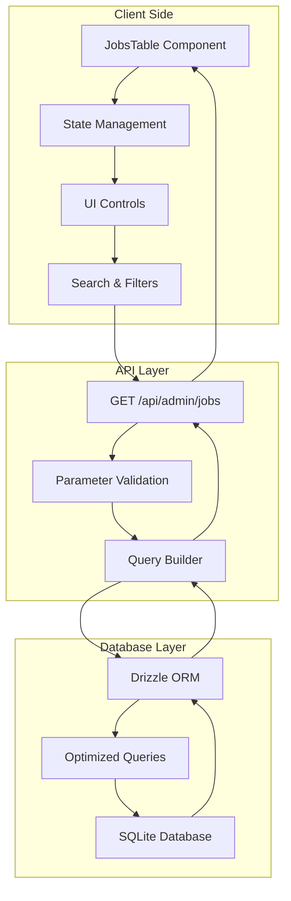
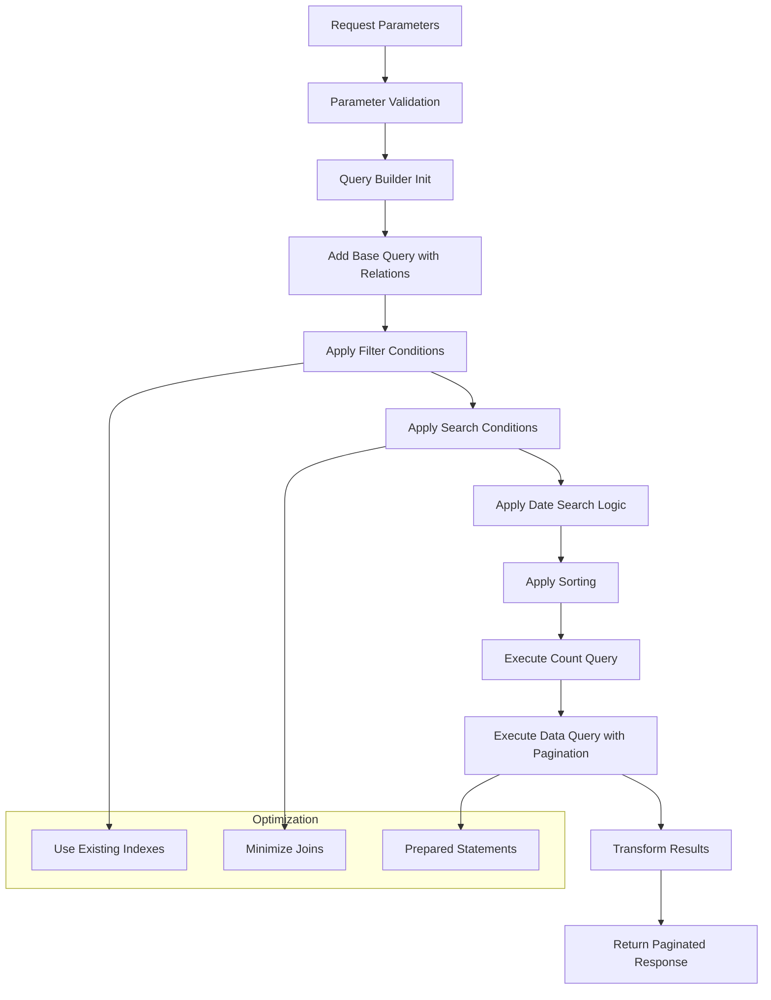
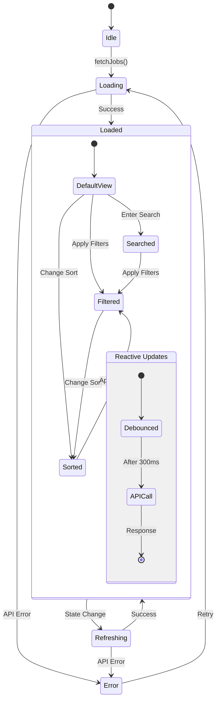
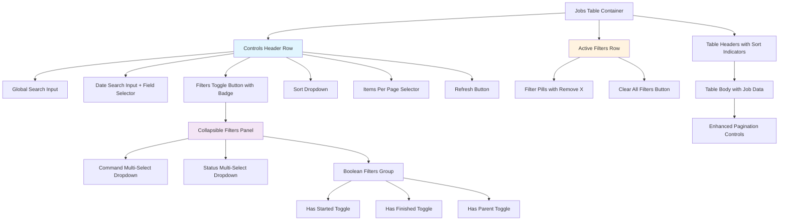
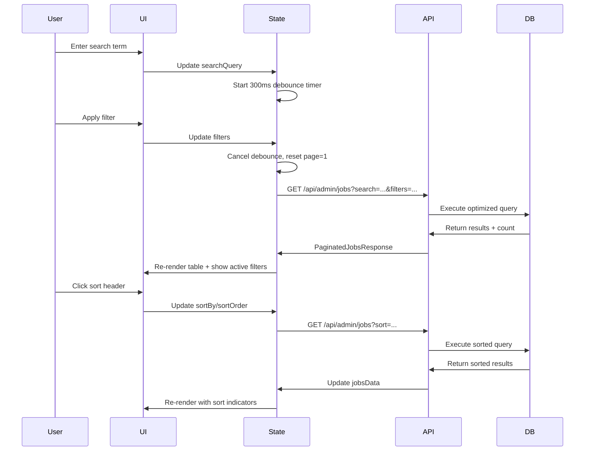
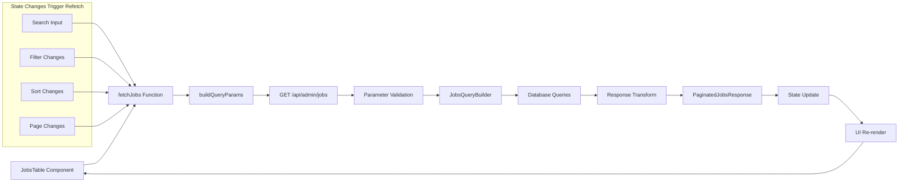
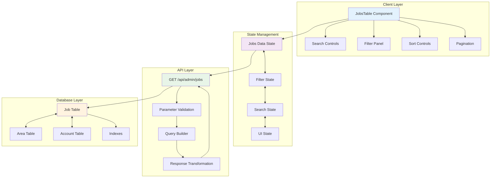
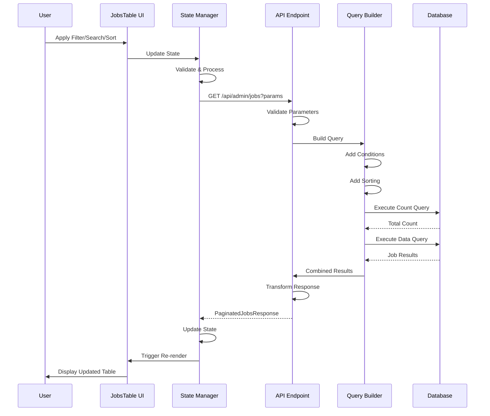
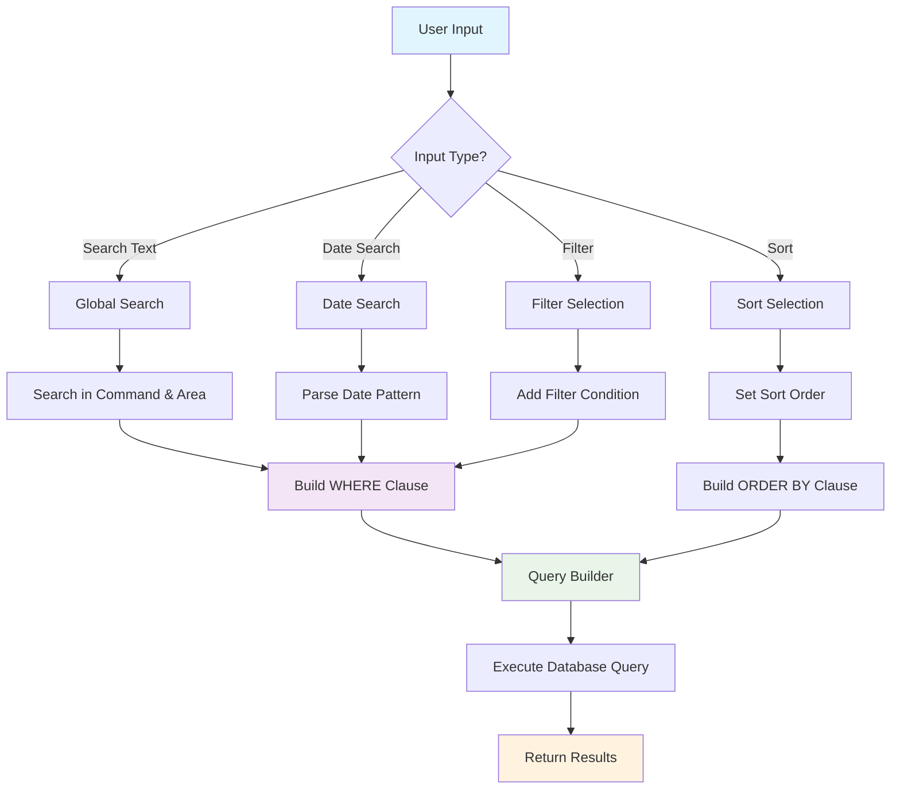

# Jobs Table Enhancement Architecture
## Comprehensive Server-Side Sorting, Filtering, and Searching Solution

**Document Version**: 1.0  
**Created**: January 6, 2025  
**Purpose**: Architectural design for enhancing the JobsTable component with server-side sorting, filtering, and searching capabilities

---

## Table of Contents

1. [Current State Analysis](#current-state-analysis)
2. [Requirements Overview](#requirements-overview)
3. [Architectural Design](#architectural-design)
4. [API Parameter Structure](#api-parameter-structure)
5. [Database Query Strategy](#database-query-strategy)
6. [Client-Side State Management](#client-side-state-management)
7. [UI Control Layout & User Experience](#ui-control-layout--user-experience)
8. [Server-Side Implementation Details](#server-side-implementation-details)
9. [Integration Points](#integration-points)
10. [Implementation Phases](#implementation-phases)
11. [Technical Considerations](#technical-considerations)
12. [Mermaid Diagrams](#mermaid-diagrams)

---

## Current State Analysis

### Current JobsTable Component
- **Location**: `src/lib/components/JobsTable.svelte`
- **Current API**: `/api/admin/jobs?page=${page}&limit=${limit}`
- **Current Features**: 
  - Basic pagination (page, limit)
  - Bulk operations (delete selected, delete all)
  - Job deletion
  - Cross-page selection tracking
- **Data Structure**: Rich `JobInformation` type with relationships

### Database Schema (Job Table)
- **Table**: `job` in SQLite (`src/lib/server/db/base-schema.ts`)
- **Key Fields Available**:
  - **Sortable**: `id`, `created_at`, `updated_at`, `started_at`, `finished_at`, `status`, `command`
  - **Filterable**: `command`, `status`, `spawned_from` (for parent relations)
  - **Searchable**: `full_path` (area), `command`, datetime fields
- **Relations**: 
  - `forArea` (area information)
  - `fromJob` (parent job)
  - `usingAccount` (account/provider)
- **Existing Indexes**: Comprehensive indexing already exists for efficient querying

### Reference Pattern
- **Pattern Source**: `src/routes/+page.svelte` shows client-side filtering/sorting for areas
- **Inspiration**: Reactive state management with derived values

---

## Requirements Overview

### Sorting Requirements
- **Fields**: created, updated, started, finished, id, parent, status, command
- **Directions**: ascending (asc) and descending (desc)
- **Default**: Most recent created first (created desc)

### Filtering Requirements
- **Command Filter**: Single or multiple `CrawlCommand` values
- **Status Filter**: Single or multiple `JobStatus` values
- **Boolean Filters**:
  - Has Started: `started_at IS NOT NULL` / `started_at IS NULL`
  - Has Finished: `finished_at IS NOT NULL` / `finished_at IS NULL`
  - Has Parent: `spawned_from IS NOT NULL` / `spawned_from IS NULL`
  - Has No Parent: `spawned_from IS NULL`

### Searching Requirements
- **Global Search**: Partial matches in area name/path and command
- **Fuzzy DateTime Matching**: Pattern matching like "yyyy-MM-dd HH:mm:ss" subset
  - Examples: "2024-01-15", "2024-01", "2024" matches respective date ranges
  - Applied to created, updated, started, finished timestamps

---

## Architectural Design

### Core Principles
1. **Server-Side Processing**: All filtering, sorting, and searching on complete dataset
2. **Performance Optimization**: Leverage existing database indexes
3. **Scalable State Management**: Reactive updates without unnecessary re-renders
4. **User Experience**: Intuitive controls with immediate feedback
5. **Type Safety**: Full TypeScript support throughout

### System Architecture Overview



---

## API Parameter Structure

### Enhanced GET `/api/admin/jobs` Parameters

```typescript
interface JobsQueryParams {
  // Pagination (existing)
  page?: number;        // default: 1
  limit?: number;       // default: 25, max: 100
  
  // Sorting (new)
  sortBy?: 'created' | 'updated' | 'started' | 'finished' | 'id' | 'parent' | 'status' | 'command';
  sortOrder?: 'asc' | 'desc';  // default: 'desc'
  
  // Filtering (new)
  command?: CrawlCommand | CrawlCommand[];     // Multiple commands supported
  status?: JobStatus | JobStatus[];           // Multiple statuses supported
  hasStarted?: boolean;                       // true = started_at IS NOT NULL
  hasFinished?: boolean;                      // true = finished_at IS NOT NULL
  hasParent?: boolean;                        // true = spawned_from IS NOT NULL
  
  // Searching (new)
  search?: string;                           // Global search across area name/path, command
  dateSearch?: string;                       // Fuzzy datetime matching
  dateField?: 'created' | 'updated' | 'started' | 'finished'; // Which date field to search
}
```

### Example API Calls

```bash
# Basic sorting
GET /api/admin/jobs?sortBy=status&sortOrder=asc

# Multiple filters
GET /api/admin/jobs?command=users,issues&status=finished&hasStarted=true

# Search with filters
GET /api/admin/jobs?search=gitlab-org&dateSearch=2024-01&dateField=created

# Complex query
GET /api/admin/jobs?search=project&command=issues&status=finished,failed&hasParent=false&sortBy=finished&sortOrder=desc&page=2
```

---

## Database Query Strategy

### Query Builder Architecture

```typescript
interface JobsQueryBuilder {
  // Base query with all relations
  baseQuery: DrizzleQuery;
  
  // Dynamic WHERE conditions
  whereConditions: WhereCondition[];
  
  // Dynamic ORDER BY clauses
  orderBy: OrderByClause[];
  
  // Optimized COUNT query (separate from data query)
  countQuery: CountQuery;
}
```

### Query Optimization Strategy

1. **Separate Count Query**: Execute count without expensive joins when possible
2. **Index Utilization**: Leverage existing comprehensive indexes
3. **Conditional Joins**: Only join related tables when necessary for search/filter
4. **Prepared Statements**: Use Drizzle ORM's prepared statement optimization

### Database Query Flow



### Date Search Implementation

```typescript
interface DateSearchHandler {
  /**
   * Parse partial date input and create date range
   * Examples:
   * - "2024" -> start: 2024-01-01 00:00:00, end: 2024-12-31 23:59:59
   * - "2024-03" -> start: 2024-03-01 00:00:00, end: 2024-03-31 23:59:59
   * - "2024-03-15" -> start: 2024-03-15 00:00:00, end: 2024-03-15 23:59:59
   */
  parseInput(input: string): DateRange | null;
  
  // Build SQL conditions for date range on specified field
  buildDateConditions(field: DateField, range: DateRange): SqlCondition[];
}

interface DateRange {
  start: Date;
  end: Date;
  precision: 'year' | 'month' | 'day' | 'hour' | 'minute' | 'second';
}
```

---

## Client-Side State Management

### State Structure

```typescript
interface JobsTableState {
  // Data
  jobsData: PaginatedJobsResponse | null;
  loading: boolean;
  error: string | null;
  
  // Pagination
  currentPage: number;
  itemsPerPage: number;
  
  // Sorting
  sortBy: JobsSortField;
  sortOrder: 'asc' | 'desc';
  
  // Filtering
  filters: {
    command: CrawlCommand[];
    status: JobStatus[];
    hasStarted: boolean | null;    // null = not set, true/false = filter value
    hasFinished: boolean | null;
    hasParent: boolean | null;
  };
  
  // Searching
  searchQuery: string;
  dateSearch: string;
  dateField: DateField;
  
  // UI State
  filtersOpen: boolean;
  selectedJobIds: Set<string>;
  
  // Derived state
  hasActiveFilters: boolean;     // computed from filters
  totalFilteredItems: number;    // from API response
  canLoadMore: boolean;          // pagination helper
}
```

### State Management Pattern



### Reactive Update Logic

```typescript
// Debounced search updates
$effect(() => {
  const timer = setTimeout(() => {
    if (searchQuery.trim() || dateSearch.trim()) {
      currentPage = 1; // Reset to first page
      fetchJobs();
    }
  }, 300);
  
  return () => clearTimeout(timer);
});

// Immediate updates for filters and sorting
$effect(() => {
  currentPage = 1; // Reset to first page
  fetchJobs();
}, [filters, sortBy, sortOrder, itemsPerPage]);

// Page navigation (no reset)
$effect(() => {
  fetchJobs();
}, [currentPage]);
```

---

## UI Control Layout & User Experience

### Enhanced Controls Layout



### Search & Filter UX Design

#### Search Controls
```html
<!-- Global Search -->
<div class="search-container">
  <Search icon />
  <input 
    placeholder="Search area names, paths, commands..."
    bind:value={searchQuery}
    class="global-search"
  />
  {#if searchQuery}
    <button onclick={() => searchQuery = ""}>Clear</button>
  {/if}
</div>

<!-- Date Search -->
<div class="date-search-container">
  <Calendar icon />
  <input 
    placeholder="2024-01-15, 2024-01, or 2024..."
    bind:value={dateSearch}
    class="date-search"
  />
  <select bind:value={dateField}>
    <option value="created">Created</option>
    <option value="updated">Updated</option>
    <option value="started">Started</option>
    <option value="finished">Finished</option>
  </select>
</div>
```

#### Filter Panel Design
```html
<!-- Collapsible Filters Panel -->
<div class="filters-panel" class:open={filtersOpen}>
  <!-- Command Filter -->
  <MultiSelect
    label="Commands"
    options={commandOptions}
    bind:selected={filters.command}
    placeholder="All commands"
  />
  
  <!-- Status Filter -->
  <MultiSelect
    label="Status"
    options={statusOptions}
    bind:selected={filters.status}
    placeholder="All statuses"
  />
  
  <!-- Boolean Filters -->
  <div class="boolean-filters">
    <ToggleFilter
      label="Has Started"
      bind:value={filters.hasStarted}
    />
    <ToggleFilter
      label="Has Finished"
      bind:value={filters.hasFinished}
    />
    <ToggleFilter
      label="Has Parent Job"
      bind:value={filters.hasParent}
    />
  </div>
</div>
```

### User Experience Flow



---

## Server-Side Implementation Details

### Enhanced API Endpoint Structure

```typescript
// src/routes/api/admin/jobs/+server.ts

interface EnhancedJobsAPI {
  GET: (params: JobsQueryParams) => Promise<PaginatedJobsResponse>;
}

class JobsQueryBuilder {
  private baseQuery: DrizzleQuery;
  private whereConditions: WhereCondition[] = [];
  private orderByConditions: OrderByClause[] = [];
  
  constructor() {
    this.baseQuery = db.query.job.findMany({
      with: {
        forArea: true,
        fromJob: {
          columns: {
            id: true,
            command: true,
            status: true,
            started_at: true,
            finished_at: true,
          }
        },
        usingAccount: {
          columns: {
            providerId: true
          }
        }
      },
      extras: {
        childrenCount: db.$count(job, eq(job.spawned_from, job.id)).as("childrenCount")
      }
    });
  }
  
  // Filtering methods
  addCommandFilter(commands: CrawlCommand[]): this {
    if (commands.length > 0) {
      this.whereConditions.push(inArray(job.command, commands));
    }
    return this;
  }
  
  addStatusFilter(statuses: JobStatus[]): this {
    if (statuses.length > 0) {
      this.whereConditions.push(inArray(job.status, statuses));
    }
    return this;
  }
  
  addBooleanFilters(filters: BooleanFilters): this {
    if (filters.hasStarted !== null) {
      this.whereConditions.push(
        filters.hasStarted 
          ? isNotNull(job.started_at)
          : isNull(job.started_at)
      );
    }
    
    if (filters.hasFinished !== null) {
      this.whereConditions.push(
        filters.hasFinished 
          ? isNotNull(job.finished_at)
          : isNull(job.finished_at)
      );
    }
    
    if (filters.hasParent !== null) {
      this.whereConditions.push(
        filters.hasParent 
          ? isNotNull(job.spawned_from)
          : isNull(job.spawned_from)
      );
    }
    
    return this;
  }
  
  // Search methods
  addGlobalSearch(searchTerm: string): this {
    if (searchTerm.trim()) {
      const searchPattern = `%${searchTerm}%`;
      this.whereConditions.push(
        or(
          like(job.command, searchPattern),
          like(area.name, searchPattern),
          like(area.full_path, searchPattern)
        )
      );
    }
    return this;
  }
  
  addDateSearch(dateInput: string, field: DateField): this {
    const dateRange = parseDateInput(dateInput);
    if (dateRange) {
      const dateColumn = getDateColumn(field);
      this.whereConditions.push(
        and(
          gte(dateColumn, dateRange.start),
          lte(dateColumn, dateRange.end)
        )
      );
    }
    return this;
  }
  
  // Sorting methods
  addSorting(sortBy: JobsSortField, order: SortOrder): this {
    const column = getSortColumn(sortBy);
    this.orderByConditions.push(
      order === 'desc' ? desc(column) : asc(column)
    );
    return this;
  }
  
  // Execution methods
  async executeWithPagination(page: number, limit: number): Promise<PaginatedJobsResponse> {
    const offset = (page - 1) * limit;
    
    // Build WHERE clause
    const whereClause = this.whereConditions.length > 0 
      ? and(...this.whereConditions) 
      : undefined;
    
    // Execute count query (optimized, minimal joins)
    const totalCount = await this.getCount(whereClause);
    
    // Execute data query with all relations
    const jobs = await this.baseQuery
      .where(whereClause)
      .orderBy(...this.orderByConditions)
      .limit(limit)
      .offset(offset);
    
    return {
      data: jobs.map(transformJobResponse),
      pagination: {
        page,
        limit,
        totalCount,
        totalPages: Math.ceil(totalCount / limit),
        hasNextPage: page < Math.ceil(totalCount / limit),
        hasPreviousPage: page > 1
      }
    };
  }
  
  private async getCount(whereClause: WhereCondition): Promise<number> {
    const result = await db
      .select({ count: sql<number>`COUNT(*)`.mapWith(Number) })
      .from(job)
      .where(whereClause);
    return result[0]?.count || 0;
  }
}
```

### Date Search Parser Implementation

```typescript
function parseDateInput(input: string): DateRange | null {
  const trimmed = input.trim();
  if (!trimmed) return null;
  
  // Try different date patterns
  const patterns = [
    /^(\d{4})$/,                           // 2024
    /^(\d{4})-(\d{1,2})$/,                // 2024-01
    /^(\d{4})-(\d{1,2})-(\d{1,2})$/,      // 2024-01-15
    /^(\d{4})-(\d{1,2})-(\d{1,2}) (\d{1,2})$/,           // 2024-01-15 14
    /^(\d{4})-(\d{1,2})-(\d{1,2}) (\d{1,2}):(\d{1,2})$/, // 2024-01-15 14:30
  ];
  
  for (const pattern of patterns) {
    const match = trimmed.match(pattern);
    if (match) {
      return createDateRange(match);
    }
  }
  
  return null;
}

function createDateRange(match: RegExpMatchArray): DateRange {
  const [, year, month, day, hour, minute] = match;
  
  const start = new Date(
    parseInt(year),
    month ? parseInt(month) - 1 : 0,
    day ? parseInt(day) : 1,
    hour ? parseInt(hour) : 0,
    minute ? parseInt(minute) : 0,
    0
  );
  
  const end = new Date(start);
  
  // Set end date based on precision
  if (!month) {
    end.setFullYear(end.getFullYear() + 1);
  } else if (!day) {
    end.setMonth(end.getMonth() + 1);
  } else if (!hour) {
    end.setDate(end.getDate() + 1);
  } else if (!minute) {
    end.setHours(end.getHours() + 1);
  } else {
    end.setMinutes(end.getMinutes() + 1);
  }
  
  end.setMilliseconds(end.getMilliseconds() - 1);
  
  return { start, end, precision: getPrecision(match) };
}
```

---

## Integration Points

### Client ↔ Server Integration Flow



### URL State Synchronization

```typescript
// URL parameter sync for bookmarkable states
interface URLState {
  page?: number;
  sortBy?: string;
  sortOrder?: string;
  search?: string;
  dateSearch?: string;
  dateField?: string;
  command?: string[];
  status?: string[];
  hasStarted?: boolean;
  hasFinished?: boolean;
  hasParent?: boolean;
}

// Sync state to URL
function syncStateToURL(state: JobsTableState) {
  const params = new URLSearchParams();
  
  if (state.currentPage > 1) params.set('page', state.currentPage.toString());
  if (state.sortBy !== 'created') params.set('sortBy', state.sortBy);
  if (state.sortOrder !== 'desc') params.set('sortOrder', state.sortOrder);
  if (state.searchQuery) params.set('search', state.searchQuery);
  if (state.dateSearch) params.set('dateSearch', state.dateSearch);
  if (state.filters.command.length) params.set('command', state.filters.command.join(','));
  // ... other filters
  
  const newURL = `${window.location.pathname}?${params.toString()}`;
  window.history.replaceState({}, '', newURL);
}
```

---

## Implementation Phases

### Phase 1: Server-Side Foundation (Priority: High)
**Duration**: 2-3 days  
**Focus**: Core API functionality

#### Tasks:
1. **Enhance API Parameter Handling**
   - Extend `/api/admin/jobs/+server.ts` with new parameters
   - Add comprehensive input validation using Zod schemas
   - Implement parameter parsing and normalization

2. **Implement JobsQueryBuilder Class**
   - Create modular query building system
   - Add filtering methods (command, status, boolean filters)
   - Implement search functionality (global and date search)
   - Add dynamic sorting capabilities

3. **Date Search Implementation**
   - Create date parsing logic for fuzzy matching
   - Implement date range generation
   - Add SQL condition building for date fields

4. **Testing & Validation**
   - Unit tests for query builder
   - Integration tests for API endpoints
   - Performance testing with large datasets

#### Deliverables:
- Enhanced API endpoint with full parameter support
- Comprehensive query builder with all filtering/searching/sorting
- Date search parser with fuzzy matching
- Unit and integration tests

### Phase 2: Client-Side Enhancement (Priority: High)
**Duration**: 3-4 days  
**Focus**: UI components and state management

#### Tasks:
1. **Extend JobsTable State Management**
   - Add new state properties for sorting, filtering, searching
   - Implement reactive state updates with proper debouncing
   - Add derived state calculations

2. **Build Search & Filter UI Components**
   - Global search input with clear functionality
   - Date search input with field selector
   - Collapsible filters panel with multi-select dropdowns
   - Boolean filter toggles (has started, finished, parent)

3. **Enhanced Table Headers**
   - Clickable sort headers with visual indicators
   - Sort direction indicators (arrows)
   - Active sort highlighting

4. **Active Filters Display**
   - Filter pills showing active filters
   - Individual filter removal (X buttons)
   - Clear all filters functionality

5. **URL State Synchronization**
   - Sync filters/search/sort to URL parameters
   - Browser back/forward support
   - Bookmarkable filter states

#### Deliverables:
- Fully enhanced JobsTable component
- Complete search and filter UI
- URL state synchronization
- Responsive design for mobile/tablet

### Phase 3: Advanced Features (Priority: Medium)
**Duration**: 2-3 days  
**Focus**: User experience improvements

#### Tasks:
1. **Filter Presets & Saved Searches**
   - Common filter combinations (e.g., "Failed Jobs", "Running Jobs")
   - User-defined saved filters
   - Quick filter buttons

2. **Enhanced Bulk Operations**
   - Bulk operations on filtered results
   - "Select all X filtered jobs" functionality
   - Bulk actions with filter context

3. **Export Functionality**
   - Export filtered job data to CSV/JSON
   - Include current filters in export filename
   - Progress indicator for large exports

4. **Real-time Updates**
   - WebSocket integration for job status updates
   - Live updates without full refresh
   - Optimistic UI updates

#### Deliverables:
- Filter presets and saved searches
- Enhanced bulk operations
- Export functionality
- Real-time update system

### Phase 4: Performance & Polish (Priority: Low)
**Duration**: 1-2 days  
**Focus**: Optimization and user experience polish

#### Tasks:
1. **Performance Optimization**
   - Query result caching (Redis integration)
   - Database query optimization analysis
   - Memory usage optimization

2. **Advanced UI Features**
   - Virtual scrolling for very large datasets
   - Progressive loading indicators
   - Keyboard navigation support

3. **Accessibility Improvements**
   - ARIA labels for screen readers
   - Keyboard shortcuts for common actions
   - High contrast mode support

4. **Documentation & Monitoring**
   - API documentation updates
   - Performance monitoring setup
   - User guide for new features

#### Deliverables:
- Performance optimizations
- Accessibility compliance
- Comprehensive documentation
- Monitoring and analytics

---

## Technical Considerations

### Performance Optimization

#### Database Level
- **Existing Indexes**: Leverage comprehensive indexing already in place
- **Query Optimization**: Use Drizzle ORM's query optimization features
- **Separate Count Queries**: Optimize count queries to avoid expensive joins
- **Index Usage Analysis**: Monitor query execution plans

#### Application Level
- **Result Caching**: Implement Redis caching for frequently accessed filter combinations
- **Debounced Search**: 300ms debounce for search inputs to reduce API calls
- **Pagination**: Server-side pagination to handle large datasets efficiently
- **State Management**: Minimize re-renders with proper state isolation

#### Network Level
- **Request Deduplication**: Prevent duplicate requests during rapid state changes
- **Response Compression**: Enable gzip/brotli compression for API responses
- **HTTP Caching**: Implement appropriate cache headers for static filter options

### Security Considerations

#### Input Validation
- **Parameter Validation**: Comprehensive Zod schema validation for all inputs
- **SQL Injection Protection**: Drizzle ORM's prepared statements provide protection
- **XSS Prevention**: Proper input sanitization and output encoding
- **Rate Limiting**: Consider implementing rate limiting for search operations

#### Authentication & Authorization
- **Admin Role Enforcement**: Maintain existing admin-only access control
- **Session Validation**: Verify session validity on each request
- **CSRF Protection**: Use existing CSRF protection mechanisms

### Scalability Considerations

#### Database Scalability
- **SQLite Limitations**: Monitor for concurrent write limitations
- **Read Replicas**: Consider read replicas for heavy query workloads
- **Database Partitioning**: Plan for potential table partitioning if dataset grows

#### Application Scalability
- **Stateless Design**: Maintain stateless API design for horizontal scaling
- **Memory Management**: Efficient memory usage for large result sets
- **Background Processing**: Consider background processing for expensive operations

#### Frontend Scalability
- **Bundle Size**: Monitor JavaScript bundle size impact
- **Virtual Scrolling**: Implement for very large datasets (1000+ items)
- **Progressive Enhancement**: Ensure basic functionality without JavaScript

### Monitoring & Analytics

#### Performance Monitoring
- **Query Performance**: Track slow query identification and optimization
- **API Response Times**: Monitor endpoint response time percentiles
- **Error Rates**: Track 4xx/5xx error rates and patterns

#### User Analytics
- **Feature Usage**: Track which filters and sorts are most commonly used
- **Search Patterns**: Analyze common search terms and patterns
- **Performance Impact**: Monitor client-side performance metrics

---

## Mermaid Diagrams

### Complete System Architecture



### Data Flow Architecture



### Filter & Search Logic Flow



---

## Conclusion

This comprehensive architecture provides a robust foundation for implementing advanced sorting, filtering, and searching capabilities in the JobsTable component. The design emphasizes:

1. **Performance**: Leveraging existing database indexes and optimized queries
2. **User Experience**: Intuitive controls with immediate feedback
3. **Scalability**: Server-side processing capable of handling large datasets
4. **Maintainability**: Modular design with clear separation of concerns
5. **Type Safety**: Full TypeScript support throughout the system

The phased implementation approach allows for incremental delivery of value while maintaining system stability. Each phase builds upon the previous one, ensuring a solid foundation for advanced features.

**Next Steps**: Begin with Phase 1 implementation, starting with the server-side API enhancements and query builder functionality.