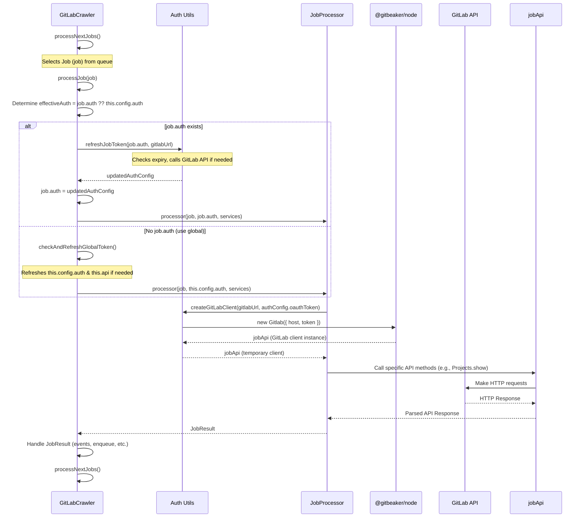

# Refactoring Plan: Per-Job Authentication for GitLab Crawler

This document outlines the plan for refactoring `src/crawler/gitlab-crawler.ts` to support per-job authentication tokens, including token refresh logic.

## Understanding the Current State

*   The `GitLabCrawler` currently uses a single, global GitLab API client (`this.api`) initialized with authentication details from the main `CrawlerConfig` (`this.config.auth`).
*   Token refresh logic (`checkAndRefreshToken`, `refreshToken`) operates solely on this global configuration and client.
*   Job processors (`JobProcessors` and the individual functions they manage) receive and use this global API client instance.
*   The `Job` interface in `src/crawler/types/job-types.ts` already includes an optional `auth?: AuthConfig` field, suitable for holding per-job credentials.
*   The `AuthConfig` interface in `src/crawler/types/config-types.ts` contains the necessary fields (`oauthToken`, `refreshToken`, `clientId`, `clientSecret`, `tokenExpiresAt`, `tokenRefreshCallback`) to manage individual OAuth tokens and their refresh cycles.

## Proposed Refactoring Plan

1.  **Token Source:** Assume that if a job requires specific credentials, the `AuthConfig` object will be provided within the `job.auth` field when the job is created or enqueued.
2.  **Fallback Behavior:** If `job.auth` is *not* provided for a specific job, the crawler will fall back to using the global authentication details defined in `this.config.auth`. (Confirmed as acceptable)
3.  **API Client Handling:** Each job processor execution will create a *temporary* GitLab API client instance configured with the appropriate token (either from `job.auth` or `this.config.auth`). This isolates token usage per job execution. (Confirmed as acceptable)
4.  **Token Refresh Logic:**
    *   Introduce a new utility function, potentially in `src/crawler/utils/auth.ts`, like `refreshJobToken(authConfig: AuthConfig, gitlabUrl: string): Promise<AuthConfig>`. This function will take an `AuthConfig` object, check if its token needs refreshing, perform the refresh using the details within that object, and return the *updated* `AuthConfig`.
    *   Keep the existing global token refresh logic (`checkAndRefreshToken`, `refreshToken`) largely as is, but ensure it only updates `this.config.auth` and the main `this.api` instance. Rename `checkAndRefreshToken` to `checkAndRefreshGlobalToken` for clarity.
5.  **Modify `GitLabCrawler.processJob`:**
    *   Determine the effective authentication for the job: `const effectiveAuth = job.auth || this.config.auth;`.
    *   Before passing `effectiveAuth` to the processor, check if it needs refreshing:
        *   If `job.auth` was used, call the *new* refresh logic: `job.auth = await refreshJobToken(job.auth, this.config.gitlabUrl);`. Update the job's auth object directly. (In-place update confirmed as acceptable)
        *   If the global auth was used, call the existing global refresh logic: `await this.checkAndRefreshGlobalToken();`.
    *   Pass the potentially updated `effectiveAuth` to the processor function.
6.  **Modify `JobProcessors` and Individual Processors:**
    *   Update the `JobProcessor` type definition in `job-types.ts` to accept the `AuthConfig` object: `type JobProcessor = (job: Job, authConfig: AuthConfig, crawlerServices: CrawlerServices) => Promise<JobResult>;` (or similar structure for passing services).
    *   Update the `JobProcessors` class to handle passing the `authConfig` and services down.
    *   Modify *each individual processor function* to:
        *   Accept the `authConfig: AuthConfig` parameter (and potentially `crawlerServices`).
        *   Create a temporary GitLab API client using `createGitLabClient(gitlabUrl, authConfig.oauthToken || '');`.
        *   Use this temporary client (`jobApi`) for all API interactions within that specific job execution.
7.  **Update Global Token Refresh Callback:** The `tokenRefreshCallback` in the *global* `this.config.auth` should only be concerned with the global token. If a `tokenRefreshCallback` is provided within a `job.auth` object, the new `refreshJobToken` function should invoke it after successfully refreshing that specific job's token.
8.  **Cleanup:** Review the usage of the main `this.api` instance. Adjust or remove `JobProcessors.updateApiClient` if processors no longer rely on the shared client.

## Visual Plan (Sequence Diagram)

## Confirmed Decisions

*   Fallback to global token if `job.auth` is missing: **Acceptable**
*   Creating temporary API client instances per job execution: **Acceptable**
*   Updating `job.auth` object in-place after refresh: **Acceptable**