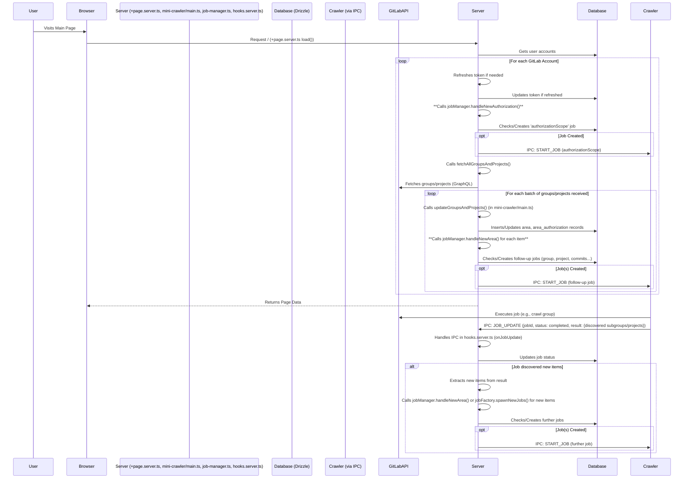

# Plan: Server-Side Job Creation Triggering

**Goal:** Ensure that new GitLab authentications and the discovery of new groups/projects trigger the creation of necessary crawling jobs directly from the SvelteKit server-side code, using the existing `job-manager` and `jobFactory` logic to handle job creation and prevent duplicates.

**Core Idea:** Trigger the existing `job-manager` functions (`handleNewAuthorization`, `handleNewArea`) from the appropriate server-side locations instead of relying solely on IPC messages from the crawler for initial job creation.

**Detailed Steps:**

1.  **Trigger Initial Scope Job on Login/Page Load:**
    *   **File:** `src/routes/+page.server.ts`
    *   **Location:** Inside the `load` function, within the `forEach` loop processing authenticated GitLab accounts (around line 152, after token refresh logic).
    *   **Action:**
        *   Add import: `import { handleNewAuthorization } from '$lib/server/job-manager';`
        *   Add call inside the loop: `await handleNewAuthorization(locals.user!.id!, x.id, opts.provider);`
    *   **Rationale:** This ensures the `authorizationScope` job is created/checked via the job manager whenever the main page loads for an authenticated user with a linked GitLab account.

2.  **Trigger Follow-up Jobs on Initial Scope Discovery:**
    *   **File:** `src/lib/server/mini-crawler/main.ts`
    *   **Location:** Inside the `updateGroupsAndProjects` function (around line 46, after existing DB inserts for `area`, `tokenScopeJobArea`, `area_authorization`).
    *   **Action:**
        *   Add import: `import { handleNewArea } from '$lib/server/job-manager';`
        *   Add a loop after the DB inserts:
            ```typescript
            // Assuming 'type' variable holds AreaType.group or AreaType.project correctly
            // and 'items' holds the list of discovered Group or Project objects
            for (const item of items) {
              await handleNewArea(item.fullPath, type, item.id, accountId);
            }
            ```
    *   **Rationale:** This ensures that when the server fetches the initial list of groups/projects via `fetchAllGroupsAndProjects`, it immediately triggers the creation of the necessary follow-up jobs (`group`, `project`, `commits`, etc.) for each discovered item using the job manager.

3.  **Handle Subsequent Discoveries via IPC (Verification):**
    *   **File:** `src/hooks.server.ts` (or wherever the `jobCompleted` IPC event is handled, likely within the `messageBusClientInstance.onJobUpdate` callback around line 330).
    *   **Action:**
        *   Verify the existing handler for the `jobCompleted` IPC message.
        *   Ensure that when a job *other than* the initial `authorizationScope` job completes (e.g., a `group` job discovering a new subgroup, or a `groupProjects` job discovering a new project), the handler correctly extracts the newly discovered items from the IPC message's `result` payload.
        *   Confirm that the handler calls `jobManager.handleNewArea` or a similar function (`jobFactory.spawnNewJobs` might also be relevant here depending on the exact structure) for these incrementally discovered items.
    *   **Rationale:** This confirms that the existing IPC mechanism correctly handles discoveries made during ongoing crawls, complementing the server-side initiation added in steps 1 and 2.

**Diagram:**



**Outcome:** This plan modifies the server-side logic to proactively create jobs upon user login/page load and initial scope discovery, ensuring comprehensive crawling without relying solely on the crawler's IPC messages for initiation. It leverages the existing `job-manager` for robust job creation and duplicate prevention.